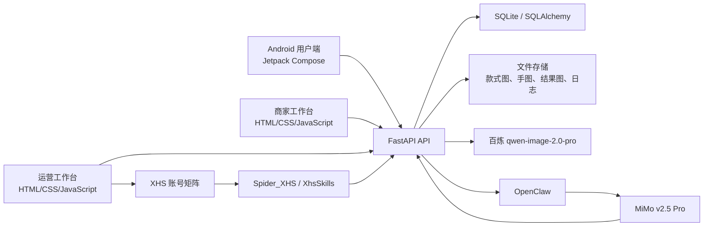

# Nail Mind

Nail Mind 是面向美甲消费与门店运营场景的 AI 应用，围绕两个核心问题构建：

- 用户在下单前无法直观看到款式上手效果。
- 运营人员难以及时识别社区爆款和站内转化趋势。

系统由 Android 用户端、FastAPI 后端、商家工作台、运营工作台和 OpenClaw 趋势分析链路组成。用户可以浏览真实款式、上传手部照片并生成 AI 试戴图；商家处理门店商品和预约；运营人员管理平台款式、查看真实埋点，并根据小红书公开内容与 OpenClaw 分析结果制定运营策略。

## 核心能力

### 用户端

- 展示 Excel 数据集导入的真实美甲款式。
- 支持款式搜索、分类浏览、详情查看和收藏。
- 上传或拍摄手部照片，调用百炼大模型生成试戴效果。
- 展示生成进度、结果预览和历史试戴记录。
- 保存试戴结果图片，并可从结果页返回款式详情。
- 查看门店、可预约时间和预约记录。
- 首页、款式、收藏、试戴和预约等页面支持真实 API 数据。

### 商家端

- 查看当前门店的在售商品和库存状态。
- 查看及处理门店预约。
- 修改门店营业时间与预约状态。
- 提交商品上架、下架等申请。
- 仅访问所属门店数据，不展示平台运营分析和社区趋势。

### 运营端

- 创建、编辑、上架和下架平台款式。
- 修改款式名称、描述、标签和展示图片。
- 审核商家提交的商品生命周期申请。
- 查看曝光、收藏、试戴、预约等真实埋点。
- 查看单款表现和站内转化趋势。
- 管理小红书登录状态并发起趋势采集。
- 展示采集到的真实帖子、互动数据和来源链接。
- 调用 OpenClaw + MiMo v2.5 Pro 分析社区趋势与站内数据。
- 审核 OpenClaw 生成的爆款款式建议。

## 技术架构



### 技术栈

| 模块 | 技术 |
| --- | --- |
| Android 客户端 | Kotlin、Jetpack Compose、Material 3、Retrofit、OkHttp、Coil、Coroutines |
| API 服务 | Python 3、FastAPI、Uvicorn、Pydantic |
| 数据访问 | SQLAlchemy 2、SQLite |
| AI 试戴 | 阿里云百炼 `qwen-image-2.0-pro` 多图编辑 |
| 趋势采集 | XHS 账号矩阵、Spider_XHS、XhsSkills、Playwright、Chromium |
| 趋势分析 | OpenClaw CLI、MiMo v2.5 Pro |
| 后台前端 | 原生 HTML、CSS、JavaScript |
| 数据导入 | OpenPyXL、Requests |
| 图片处理 | Pillow |
| 部署 | Docker、Docker Compose、阿里云容器镜像服务 |
| 日志 | Python Logging、Loguru、容器日志 |

## 系统流程

### AI 试戴流程

1. 用户在客户端选择一个真实款式。
2. 用户拍摄、上传或复用手部照片。
3. 客户端将手图上传至 `POST /api/tryon/upload-hand`。
4. 客户端通过 `POST /api/tryon/try-on` 提交手图和款式。
5. 后端检查相同手图与款式是否已有缓存结果。
6. 未命中缓存时，后端将手图和增强款式图发送给百炼。
7. 百炼仅修改手部照片中的指甲区域，保留手型、肤色、姿态和背景。
8. 后端下载结果图，保存到 `DATA_DIR/results/` 并写入试戴记录。
9. 客户端展示结果预览，用户可以保存图片、收藏款式或预约同款。

当前正式试戴链路只使用大模型生成，不使用 OpenCV 贴图作为用户结果。

### 社区趋势流程

1. 运营人员在账号矩阵中完成小红书账号登录。
2. 运营端提交关键词、采集数量和“最多点赞”等排序条件。
3. 后端读取账号矩阵保存的有效登录态。
4. Spider_XHS/XhsSkills 搜索公开笔记并读取详情。
5. 后端校验帖子 URL、标题、作者、图片和互动数据。
6. 合格帖子写入 `trend_topics` 与 `trend_posts`。
7. OpenClaw 使用 MiMo v2.5 Pro 分析帖子内容、点赞、收藏、评论及款式特征。
8. 系统结合站内真实曝光、收藏、试戴和预约数据生成运营建议。
9. 运营端展示来源帖子、建议款式名称、图片、理由和审核操作。

OpenClaw 不负责 AI 试戴出图；百炼不负责社区趋势分析。

### 真实埋点流程

客户端通过 `POST /api/events` 上报真实用户行为。后端保存事件原始记录，并按款式累计指标。

主要事件包括：

- 款式曝光与详情查看。
- 收藏和取消收藏。
- 发起试戴与试戴完成。
- 查看门店和发起预约。
- 预约创建与确认。

运营报表从 `event_logs` 和业务表实时聚合，不生成虚假的演示指标。

## 角色与权限

| 角色 | 权限 |
| --- | --- |
| 普通用户 | 浏览款式、收藏、AI 试戴、预约、查看个人记录 |
| 商家管理员 | 管理所属门店商品、库存、营业设置、预约和商品申请 |
| 平台运营管理员 | 管理全平台款式、审核申请、查看埋点、采集趋势、审核 OpenClaw 建议 |

开发环境默认后台账号：

```text
运营端：operator@nailmind.app / 123456
商家端：merchant@nailmind.app / 123456
```

这些账号仅用于开发和比赛演示。正式部署前必须修改密码、`JWT_SECRET` 和 `WORKER_TOKEN`。

## 项目结构

```text
.
├── client/
│   └── android/                    Android 用户端
│       ├── app/src/main/           应用源码与资源
│       ├── design/app-icon.svg     桌面图标源文件
│       └── local.properties.example
├── server/
│   ├── api/
│   │   ├── app/
│   │   │   ├── admin_web/          商家端与运营端页面
│   │   │   ├── services/           AI 试戴与趋势服务
│   │   │   ├── main.py             API 路由和业务入口
│   │   │   └── models.py           数据模型
│   │   ├── deploy/                 远程部署配置
│   │   ├── import_data.py          Excel 数据导入
│   │   ├── batch_generate.py       试戴缓存预生成
│   │   ├── .env.example            基础配置模板
│   │   └── .env.ai.example         AI Key 配置模板
│   └── trend_agent/
│       ├── main.py                 OpenClaw 趋势任务
│       ├── .env.openclaw.example   OpenClaw 配置模板
│       └── docker-compose.openclaw.yml
└── 命题三美甲评测数据（对外版）.xlsx
```

## 数据模型

主要业务表包括：

- `users`：用户、商家管理员和运营管理员。
- `merchants`：商家主体。
- `stores`：门店和营业设置。
- `styles`：客户端款式信息。
- `nail_style_assets`：增强款式图及本地资源。
- `hand_images`：预设和用户上传的手图。
- `favorites`：用户收藏。
- `try_on_records`：同步试戴记录。
- `try_on_jobs`：兼容保留的异步任务记录。
- `bookings`：预约记录。
- `store_style_listings`：门店商品和库存。
- `style_lifecycle_requests`：商家上架、下架申请。
- `event_logs`：真实埋点原始记录。
- `trend_topics`：社区趋势主题。
- `trend_posts`：经过校验的来源帖子。
- `trend_recommendations`：OpenClaw 运营建议。

## 环境要求

### Android

- Android Studio。
- JDK 17。
- Android SDK 35。
- Android 8.0（API 26）或更高版本的设备。

### 后端

- Python 3.11 或兼容版本。
- Docker 与 Docker Compose，或本地 Python 虚拟环境。
- 可访问百炼 API。

### 趋势采集

- Node.js 与 OpenClaw CLI。
- 已在 OpenClaw 中配置 MiMo v2.5 Pro。
- Playwright 和 Chromium。
- 可用的小红书账号登录态。
- Spider_XHS/XhsSkills 运行目录。

## 配置说明

所有密钥和运行配置必须放在本地配置文件或服务器环境变量中，不要提交到 Git。

### 后端基础配置

```bash
cd server/api
cp .env.example .env
```

重点配置：

```dotenv
APP_NAME=Nail Mind API
ADDR=0.0.0.0
PORT=8080
DATABASE_URL=sqlite:////app/data/nailmind.db
DATA_DIR=/app/data
PUBLIC_BASE_URL=http://localhost:8080
ALLOWED_ORIGINS=*
JWT_SECRET=请替换为足够长的随机字符串
WORKER_TOKEN=请替换为足够长的随机字符串
```

### 百炼配置

```bash
cd server/api
cp .env.ai.example .env.ai
```

填写：

```dotenv
DASHSCOPE_API_KEY=你的百炼_API_Key
```

当前 API 默认读取 `.env`。本地运行时可以将 AI 配置追加到 `.env`：

```bash
cat .env.ai >> .env
```

或直接通过系统环境变量、Docker Compose `env_file` 注入。

### 小红书采集配置

```dotenv
XHS_COLLECTOR_BACKEND=xhs_skill
XHS_SKILL_PATH=/app/data/XhsSkills
SPIDER_XHS_PATH=/opt/Spider_XHS
XHS_STORAGE_STATE_PATH=/app/data/xhs-storage-state.json
NODE_PATH=/app/data/XHS_ALL_IN_ONE/node_modules
```

登录态可以由运营端账号矩阵保存。登录过期时，趋势采集会明确返回“登录已过期”，不会使用伪造帖子或虚假互动数据代替。

### OpenClaw 配置

```bash
cd server/trend_agent
cp .env.openclaw.example .env.openclaw
```

填写或确认：

```dotenv
OPENCLAW_CLI=/usr/bin/openclaw
OPENCLAW_MODEL=mimo-v2.5-pro
OPENCLAW_USE_GATEWAY=false
OPENCLAW_TIMEOUT_SECONDS=180
OPENCLAW_EXTRA_ARGS=
TREND_AGENT_IMPORT_DEMO=false
TREND_AGENT_ALLOW_RULE_FALLBACK=false
```

MiMo API Key 由服务器上的 OpenClaw 配置管理。Nail Mind 不需要额外定义一个“OpenClaw API Key”，只需要能够执行已配置完成的 OpenClaw CLI。

## 本地运行

### 1. 启动后端

```bash
cd server/api
python3 -m venv .venv
source .venv/bin/activate
pip install -r requirements.txt
cp .env.example .env
cp .env.ai.example .env.ai
cat .env.ai >> .env
python main.py
```

验证：

```bash
curl http://127.0.0.1:8080/health
```

正常响应：

```json
{"status":"ok"}
```

API 文档：

```text
http://127.0.0.1:8080/docs
```

后台入口：

```text
http://127.0.0.1:8080/admin
```

### 2. 导入 Excel 数据

将赛题数据文件放在项目根目录，然后执行：

```bash
cd server/api
source .venv/bin/activate
python import_data.py
```

脚本会：

1. 读取 `款式图` sheet。
2. 读取并去重 `手图` sheet。
3. 下载增强款式图和手图。
4. 按稳定编号保存到 `DATA_DIR/static/`。
5. 将真实款式和手图写入数据库。

重复执行时会更新已有记录，不应重复生成同一条基础数据。

### 3. 配置 Android 客户端

```bash
cd client/android
cp local.properties.example local.properties
```

模拟器访问本机后端：

```properties
sdk.dir=/你的/Android/sdk
NAILMIND_API_BASE_URL=http://10.0.2.2:8080/
NAILMIND_API_MEDIA_BASE_URL=http://10.0.2.2:8080/
NAILMIND_API_TIMEOUT_SECONDS=20
```

真机访问时，将地址替换为电脑局域网 IP 或线上服务器地址，并保留结尾 `/`。

使用 Android Studio 打开 `client/android`，等待 Gradle Sync 后运行 `app` 模块。

### 4. 构建 APK

Debug APK：

```bash
cd client/android
./gradlew :app:assembleDebug
```

输出位置：

```text
client/android/app/build/outputs/apk/debug/app-debug.apk
```

Debug APK 使用 Android 调试证书签名，可用于比赛演示和分发测试。

正式 Release APK 需要在 `local.properties` 或环境变量中配置：

```properties
NAILMIND_RELEASE_STORE_FILE=/absolute/path/release.keystore
NAILMIND_RELEASE_STORE_PASSWORD=***
NAILMIND_RELEASE_KEY_ALIAS=***
NAILMIND_RELEASE_KEY_PASSWORD=***
NAILMIND_VERSION_CODE=3
NAILMIND_VERSION_NAME=1.0.2
```

然后执行：

```bash
./gradlew :app:assembleRelease
```

## Docker 部署

### 本地 Docker Compose

```bash
cd server/api
cp .env.example .env
cat .env.ai.example >> .env
mkdir -p deploy/data deploy/models
docker compose up --build -d
```

查看状态和日志：

```bash
docker compose ps
docker compose logs -f
```

### 服务器部署

远程部署模板位于：

```text
server/api/deploy/docker-compose.remote.yml
server/api/deploy/DEPLOYMENT.md
```

推荐服务器目录：

```text
/opt/nailmind/
├── docker-compose.yml
├── .env
├── data/
│   ├── nailmind.db
│   ├── static/
│   ├── uploads/
│   ├── results/
│   ├── logs/
│   ├── XhsSkills/
│   └── XHS_ALL_IN_ONE/
├── models/
└── openclaw-runtime/
```

部署后检查：

```bash
docker compose -f /opt/nailmind/docker-compose.yml ps
curl http://127.0.0.1:8080/health
docker logs -f nailmind-api
```

当前比赛环境后台入口：

```text
http://121.40.171.199:8080/admin
```

## 主要 API

### 用户认证

```text
POST /api/auth/register
POST /api/auth/login
GET  /api/auth/me
POST /api/auth/logout
```

### 款式与收藏

```text
GET    /api/home
GET    /api/styles
GET    /api/styles/search
GET    /api/styles/{style_id}
GET    /api/favorites
POST   /api/favorites/{style_id}
DELETE /api/favorites/{style_id}
```

### AI 试戴

```text
GET  /api/tryon/hand-images
POST /api/tryon/upload-hand
POST /api/tryon/try-on
GET  /api/tryon/history
```

试戴请求示例：

```json
{
  "handId": "hand_01",
  "styleId": 1
}
```

响应示例：

```json
{
  "result_url": "http://127.0.0.1:8080/files/results/hand_01+style_01.png",
  "duration_ms": 12840,
  "style_name": "法式简约",
  "source": "bailian-live"
}
```

`source` 可能为：

- `bailian-live`：本次由百炼生成。
- `bailian-cached`：直接复用已生成缓存。

### 门店与预约

```text
GET  /api/stores
GET  /api/stores/{store_id}
GET  /api/stores/{store_id}/slots
GET  /api/bookings
POST /api/bookings
GET  /api/bookings/{booking_code}
POST /api/bookings/{booking_code}/confirm
```

### 埋点

```text
POST /api/events
```

### 运营与商家

```text
POST /admin/auth/login
GET  /admin/auth/me
GET  /admin/styles
PATCH /admin/styles/{style_id}
POST /admin/styles/{style_id}/status
POST /admin/styles/{style_id}/image
GET  /admin/analytics/overview
GET  /admin/analytics/events
GET  /admin/trends/dashboard
POST /admin/trends/crawl
POST /admin/trends/analyze
GET  /admin/trends/xhs-status
GET  /admin/merchants/me/dashboard
GET  /admin/merchants/me/listings
GET  /admin/merchants/me/bookings
POST /admin/merchants/me/requests
```

完整接口以启动后的 `/docs` 为准。

## 日志与运行数据

默认数据目录为 `DATA_DIR`，主要内容：

```text
DATA_DIR/
├── nailmind.db
├── static/styles/
├── static/hands/
├── uploads/
├── results/
└── logs/
    ├── api.log
    └── trend-agent.log
```

日志记录：

- API 请求路径、状态码和耗时。
- 登录、权限校验和后台操作。
- AI 试戴调用、缓存命中、成功与失败原因。
- 小红书采集状态和登录态异常。
- OpenClaw 调用结果和趋势任务错误。

不要将数据库、用户上传图片、生成结果、登录态或日志提交到 Git。

## 测试

后端测试：

```bash
cd server/api
source .venv/bin/activate
python -m unittest discover -s tests
```

Android 构建验证：

```bash
cd client/android
./gradlew :app:assembleDebug
```

部署后健康检查：

```bash
curl http://127.0.0.1:8080/health
```

## 安全说明

- 不要把百炼 Key、MiMo Key、Cookie、JWT Secret 或 keystore 密码写入源码。
- 小红书登录态文件属于敏感数据，必须限制文件权限。
- 生产环境应使用 HTTPS，并收紧 `ALLOWED_ORIGINS`。
- 默认演示账号和密码必须在正式上线前替换。
- 用户上传的手部照片仅应用于试戴和相关业务流程。
- 社区趋势功能应遵守目标平台规则，仅处理授权或合规获取的数据。

## 当前状态

- Android 用户端、FastAPI API、商家端和运营端已完成联调。
- 25 款真实美甲数据可由 Excel 导入并在客户端展示。
- AI 试戴采用百炼大模型生成并支持结果缓存。
- 商家端与运营端已进行角色隔离。
- 站内运营分析使用真实业务数据和真实埋点。
- OpenClaw 已接入 MiMo v2.5 Pro，用于社区趋势和站内产品趋势分析。
- 小红书采集依赖有效登录态；登录失效时需要在账号矩阵重新登录。

## 相关文档

- [Android 客户端说明](client/android/README.md)
- [后端说明](server/api/README.md)
- [AI 试戴设计](server/api/docs/ai-tryon-service-design.md)
- [远程部署说明](server/api/deploy/DEPLOYMENT.md)
- [OpenClaw 趋势服务](server/trend_agent/README.md)
