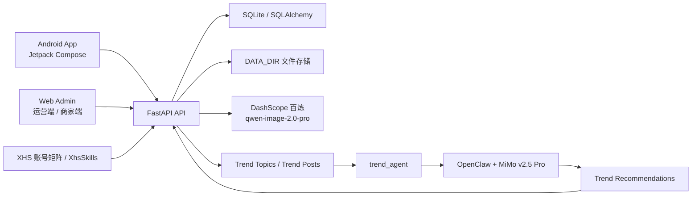
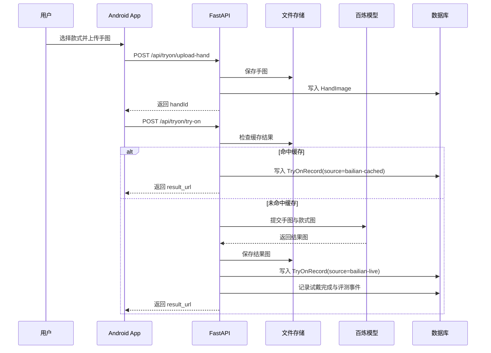
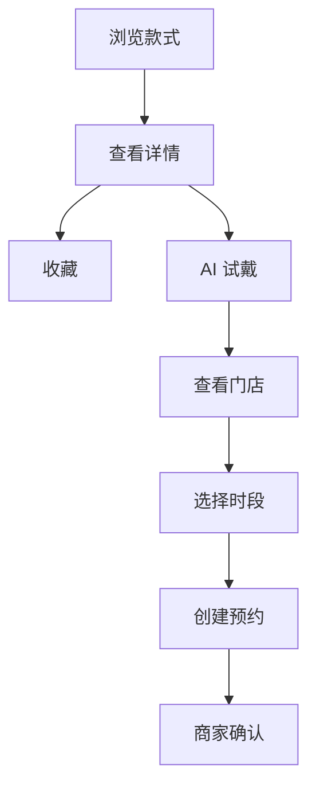
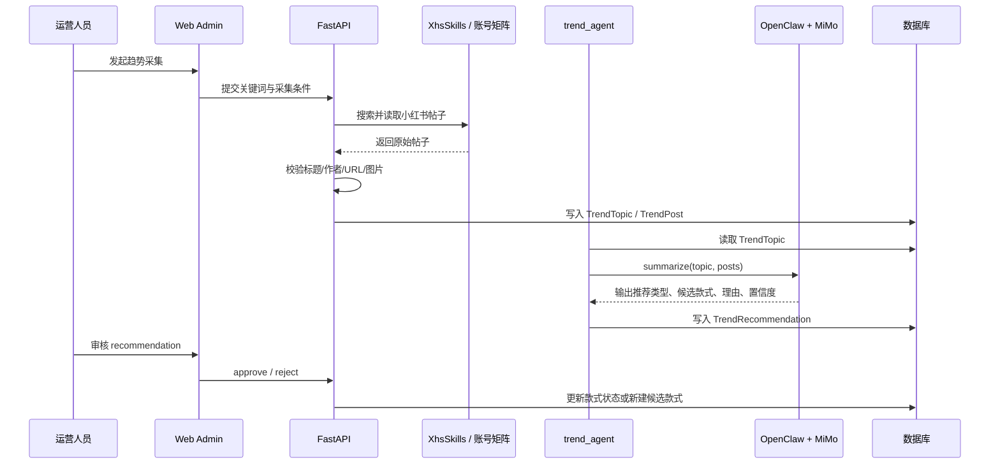

# NailMind 项目方案设计文档

## 1. 需求背景

NailMind 是一个面向美甲消费与门店运营的 AI 项目，目标不是只做单点试戴，而是打通“用户决策 - 门店转化 - 运营选款”三条链路：

- 用户侧：用户在下单前希望直观看到某个款式上手后的效果，并快速完成收藏、预约和复访。
- 商家侧：门店需要管理在售款式、库存、营业时段和预约情况。
- 运营侧：平台需要基于站内转化与站外社区内容判断什么款式值得上新、加推或下架。

因此，项目必须同时提供：

- 一个能承接真实业务流程的移动端应用
- 一套统一的后端服务与数据模型
- 一个覆盖运营和商家角色的管理端
- 一条连接小红书趋势采集、模型分析与运营决策的趋势链路

## 2. 需求分析

### 2.1 核心业务需求

| 角色 | 需求 | 系统响应 |
| --- | --- | --- |
| 普通用户 | 浏览真实款式、上传手图、生成试戴图、收藏、预约 | Android App + FastAPI + AI 试戴链路 |
| 商家管理员 | 查看所属门店商品、库存、预约、营业时间 | Web Admin + 门店隔离权限 |
| 平台运营管理员 | 查看埋点漏斗、试戴评测、社区趋势、审核推荐 | Web Admin + 趋势分析链路 |

### 2.2 非功能需求

| 维度 | 要求 |
| --- | --- |
| 一致性 | App、Web Admin 与后端共用同一套业务数据 |
| 时延 | 用户主流程优先提供同步体验，能命中缓存时不重复生成 |
| 可维护性 | 客户端、后端、管理端、趋势代理拆分清晰，可独立建仓 |
| 可评测性 | 时延、还原度、一致性、热度和转化都能从真实记录回溯 |
| 可扩展性 | 趋势分析与主 API 解耦，避免高时延任务拖慢用户请求 |

### 2.3 关键问题拆解

1. 如何让用户在移动端获得稳定、可复用的 AI 试戴体验。
2. 如何用统一后端同时服务用户端、商家端和运营端。
3. 如何把小红书趋势、站内埋点和模型建议串成闭环，而不是孤立展示。
4. 如何在演示和比赛环境下，用真实数据而不是硬编码假指标支撑评测结果。

## 3. 项目总体架构

### 3.1 模块划分

| 模块 | 目录 | 职责 |
| --- | --- | --- |
| Android 客户端 | `app/android` 或 `client/android` | 用户浏览、试戴、收藏、预约、个人中心 |
| 后端 API | `backend/api` 或 `server/api` | 用户/门店/运营接口、试戴编排、埋点聚合 |
| 趋势代理 | `backend/trend_agent` 或 `server/trend_agent` | 离线生成趋势推荐 |
| 管理端前端 | `web-admin` | 商家与运营管理页面 |
| 项目文档与方案 | `docs` | 设计、方案、说明文档 |

### 3.2 拆分原则

当前工作区同时保留原单仓库目录和拆分后目录：

- `app/`：Android 客户端仓库
- `backend/`：后端仓库
- `web-admin/`：管理端仓库
- `server/`、`client/`：原单仓库历史副本

正式交付时建议以拆分后的三仓为主，原目录仅作为迁移过渡。

## 4. 各子系统设计

### 4.1 Android 客户端

客户端基于 Jetpack Compose，当前已经覆盖五个一级入口：

- 首页
- 款式
- AI 试戴
- 预约
- 我的

客户端职责：

- 调用认证、款式、收藏、门店、预约和试戴 API
- 上传手图并展示试戴进度与结果
- 承接收藏、预约和历史记录等后续动作
- 上报曝光、点击、试戴、预约等埋点事件

客户端不直接接触趋势采集和运营能力，只消费用户态业务接口。

### 4.2 后端 API 与数据库

FastAPI 主服务是整个项目的业务中台，负责三类接口：

- 用户接口：认证、款式、收藏、预约、试戴、个人设置
- 商家接口：门店商品、库存、预约处理、生命周期申请
- 运营接口：埋点看板、试戴质量、趋势话题、推荐审核

数据层使用 SQLAlchemy + SQLite，主要表包括：

- 用户与权限：`users`、`session_tokens`、`merchants`
- 内容与交易：`styles`、`nail_style_assets`、`stores`、`store_style_listings`、`favorites`、`bookings`
- 试戴：`hand_images`、`try_on_jobs`、`try_on_records`
- 运营分析：`event_logs`、`style_metrics_daily`、`trend_topics`、`trend_posts`、`trend_recommendations`

### 4.3 Web Admin

管理端目前是原生 HTML/CSS/JavaScript 静态前端，分为两类使用者：

- 商家角色：只看所属门店的商品与预约
- 运营角色：可查看站内指标、趋势推荐和审核结果

设计重点不是前端框架本身，而是权限边界：

- 商家不能读取全平台趋势和全局埋点
- 运营可以审核趋势推荐、管理款式生命周期和查看聚合指标

### 4.4 趋势代理

`trend_agent` 不直接对用户提供接口，而是作为离线分析组件：

1. API 侧负责采集与过滤社区帖子
2. `trend_agent` 读取 `TrendTopic`
3. 通过 OpenClaw + MiMo v2.5 Pro 生成推荐摘要
4. 写回 `TrendRecommendation`
5. 由运营端审核后决定是否上新、加推或下架

这种设计把“采集、分析、审核、执行”四个阶段分开，避免模型直接修改业务数据。

## 5. 核心流程设计

### 5.1 用户 AI 试戴流程

### 5.2 预约转化流程

这个流程体现了项目不是孤立的“图片生成器”，而是把试戴与门店转化串起来。

### 5.3 社区趋势到运营推荐流程

## 6. 数据库 ER 图

下面的 ER 图描述了项目数据库中的核心实体、主键/外键关系和业务分层。

```mermaid
erDiagram
    MERCHANTS {
        int id PK
        string code UK
        string name
        datetime created_at
    }

    USERS {
        int id PK
        string email UK
        string role
        int merchant_id FK
        string managed_store_code
        bool is_active
        datetime created_at
    }

    SESSION_TOKENS {
        int id PK
        int user_id FK
        string token UK
        datetime created_at
    }

    STORES {
        int id PK
        string code UK
        int merchant_id FK
        string name
        string open_hours
        bool is_accepting_bookings
        datetime updated_at
    }

    STYLES {
        int id PK
        string code UK
        string name
        string status
        string vibe
        string price
        datetime updated_at
    }

    NAIL_STYLE_ASSETS {
        int id PK
        string style_code UK
        int sequence_no UK
        string local_image_path
        string enhanced_url
        datetime updated_at
    }

    STORE_STYLE_LISTINGS {
        int id PK
        string store_code
        string style_code
        int inventory_count
        string status
        datetime updated_at
    }

    FAVORITES {
        int id PK
        int user_id FK
        string style_id
        datetime created_at
    }

    BOOKINGS {
        int id PK
        int user_id FK
        string store_id
        string style_id
        string status
        datetime created_at
        datetime confirmed_at
    }

    HAND_IMAGES {
        int id PK
        string hand_code UK
        string source_type
        string local_path
        datetime created_at
    }

    TRY_ON_JOBS {
        int id PK
        string job_code UK
        int user_id FK
        string style_id
        string status
        string result_image_key
        datetime completed_at
    }

    TRY_ON_RECORDS {
        int id PK
        int user_id
        int hand_image_id FK
        int nail_style_asset_id FK
        string result_url
        string source
        int duration_ms
        datetime created_at
    }

    EVENT_LOGS {
        int id PK
        string event_id UK
        string event_name
        int user_id
        string style_id
        string store_id
        datetime occurred_at
    }

    TREND_TOPICS {
        int id PK
        string topic_key UK
        string title
        string cluster_label
        float community_heat_score
        datetime last_seen_at
    }

    TREND_POSTS {
        int id PK
        int topic_id FK
        string post_id
        string author
        string url
        int like_count
        int collect_count
        int comment_count
    }

    TREND_RECOMMENDATIONS {
        int id PK
        string recommendation_code UK
        string recommendation_type
        string target_style_code
        string candidate_name
        float confidence_score
        string status
    }

    STYLE_METRICS_DAILY {
        int id PK
        string style_id
        date metric_date
        int impressions
        int clicks
        int tryon_starts
        int booking_creates
        float composite_recommendation_score
    }

    STYLE_LIFECYCLE_REQUESTS {
        int id PK
        string request_code UK
        int requested_by_user_id FK
        int merchant_id FK
        string store_code
        string style_code
        string requested_action
        string status
    }

    MERCHANTS ||--o{ USERS : manages
    MERCHANTS ||--o{ STORES : owns
    MERCHANTS ||--o{ STYLE_LIFECYCLE_REQUESTS : submits
    USERS ||--o{ SESSION_TOKENS : holds
    USERS ||--o{ FAVORITES : creates
    USERS ||--o{ BOOKINGS : places
    USERS ||--o{ TRY_ON_JOBS : starts
    USERS ||--o{ STYLE_LIFECYCLE_REQUESTS : requests
    STORES ||--o{ STORE_STYLE_LISTINGS : lists
    STYLES ||--o{ STORE_STYLE_LISTINGS : appears_in
    STYLES ||--o{ FAVORITES : is_favorited
    STYLES ||--o{ BOOKINGS : is_booked
    STYLES ||--o{ EVENT_LOGS : generates
    STYLES ||--o{ STYLE_METRICS_DAILY : aggregates
    STYLES ||--o{ STYLE_LIFECYCLE_REQUESTS : targets
    NAIL_STYLE_ASSETS }o--|| STYLES : maps_to
    HAND_IMAGES ||--o{ TRY_ON_RECORDS : source_image
    NAIL_STYLE_ASSETS ||--o{ TRY_ON_RECORDS : renders
    TREND_TOPICS ||--o{ TREND_POSTS : contains
    TREND_TOPICS ||--o{ TREND_RECOMMENDATIONS : produces
```

### 6.1 ER 图解读

- `users`、`merchants`、`stores` 组成账号与门店权限主干。
- `styles` 是业务款式主表，`nail_style_assets` 是试戴素材表，两者通过 `style_code` 映射。
- `favorites`、`bookings`、`event_logs`、`style_metrics_daily` 共同描述用户兴趣与转化漏斗。
- `hand_images`、`try_on_jobs`、`try_on_records` 描述试戴输入、任务和结果。
- `trend_topics`、`trend_posts`、`trend_recommendations` 构成社区趋势分析闭环。
- `style_lifecycle_requests` 用于商家提交上架、下架等生命周期申请，交由运营审核。

## 7. 评测设计与结果

### 7.1 评测数据基础

仓库内的 `命题三美甲评测数据（对外版）.xlsx` 提供了项目初始化与评测基础数据：

- `手图` sheet：25 条手图样本 URL
- `款式图` sheet：25 条原始款式图 URL
- `款式图` sheet：25 条增强后款式图 URL

这些数据通过 `import_data.py` 导入，用于构建：

- 试戴素材库
- 手图样本库
- 客户端展示与试戴映射关系

### 7.2 评测口径

项目当前围绕三类指标做评测：

| 指标 | 口径 | 数据来源 |
| --- | --- | --- |
| 试戴平均时延 | `TryOnRecord.duration_ms` 在时间窗口内的均值，并计算 99% 置信区间 | `try_on_records` |
| 款式还原度 | `styleFidelity` 评测平均值 | `event_logs` 中质量评测事件 |
| 手工一致性 | `manualConsistency` 评测平均值 | `event_logs` 中质量评测事件 |

此外，运营侧还会结合：

- 曝光量
- 点击量
- 收藏量
- 试戴开始/完成量
- 预约创建/确认量

来构建漏斗和推荐分数。

### 7.3 当前可复现样例结果

现有测试 `backend/api/tests/test_api.py` 中已经验证了一组评测样例，结果如下：

| 指标 | 当前样例值 |
| --- | --- |
| 平均试戴时延 | `10000 ms` |
| 样本数 | `2` |
| 置信水平 | `99%` |
| 款式还原度 | `0.93` |
| 手工一致性 | `0.88` |

这些结果来自测试中写入的真实 `TryOnRecord` 和质量评测事件，用于证明：

- 评测逻辑已接入代码，不是文档口径
- 指标可以从数据库记录中实时聚合
- 运营端展示的是脱敏聚合结果，而不是硬编码分数

### 7.4 评测结论

从当前实现可以得出三点：

1. 项目已具备可运行的端到端试戴闭环，评测指标能够从真实记录生成。
2. 趋势推荐链路已具备“采集 - 分析 - 审核 - 执行”的完整结构，不是单纯展示社区帖子。
3. 数据层仍以 SQLite 和本地文件目录为主，适合演示与比赛环境，但若进入生产级场景还需要进一步演进。

## 8. 项目优势与风险

### 8.1 优势

- 不是单点功能，而是围绕“种草 - 试戴 - 预约 - 运营选款”构建完整业务链路
- 项目模块划分清晰，已具备按 App、Backend、Web Admin 独立建仓的条件
- 试戴质量、热度和转化指标已具备可追溯评测口径

### 8.2 风险

- AI 试戴受外部模型可用性和余额状态影响
- 小红书采集依赖登录态与第三方页面结构
- SQLite 与单机文件存储更适合演示，不适合高并发扩展

## 9. 后续优化方向

1. 将 SQLite 迁移到更适合多实例写入的数据库。
2. 将用户手图、试戴结果和款式资源迁移到对象存储。
3. 为趋势采集和趋势分析增加更完整的任务编排、重试和监控。
4. 继续补充真实用户试戴样本，形成比赛版或答辩版评测报告。
