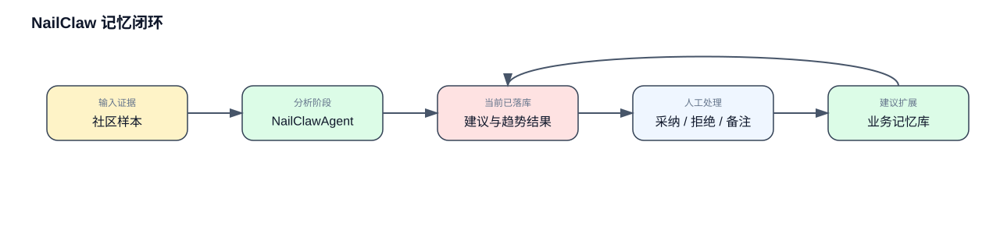

# NailMind 方案设计文档

## 1. 需求背景

NailMind 面向两个场景：用户选款和平台运营。用户在下单前最缺的是直观反馈，只看款式图，很难判断颜色、风格和手部效果是否真的适合自己。商家和运营的关注点则更偏向经营侧，包括款式管理、预约履约、库存安排，以及试戴和预约之间的转化情况。

项目目前按三个目录拆分：`app/` 负责用户侧移动端，`backend/` 负责业务和数据，`web-admin/` 负责商家与运营后台。下面就按这三个部分展开，梳理整体结构、核心流程、数据关系和评测结果。

## 2. 需求分析

从业务上看，这个系统至少要同时满足三类需求。

- 用户侧需要完成浏览、试戴、收藏和预约，流程要顺，返回结果要快。
- 商家侧需要管理门店款式和预约，但权限要收住，只能看到自己的门店数据。
- 运营侧需要看到真实的埋点、试戴质量和趋势建议，方便做上新、加推和下架决策。

对应到系统设计，三个目录的分工也就比较清楚了。`app/` 主要负责用户交互和 API 调用，`backend/` 负责业务规则、数据库和 AI 试戴，`web-admin/` 提供后台操作入口。大模型和社区内容抓取这类外部能力，也统一从 `backend/` 接入。

## 3. 架构设计

### 3.1 组件关系

这里先只看最核心的结构。`app/` 和 `web-admin/` 是两个入口，统一访问 `backend/`；后端内部再拆成业务服务和能力服务，下面接数据存储，右侧接外部能力。这样读起来更直接，主链路也更清楚。

### 3.2 NailClaw 架构

`NailClaw` 更适合按 agent 来看，而不是把它简单当成一个后端模块。它接收社区样本和站内指标，`Role / Prompt` 负责限定目标和输出格式，`Model` 负责生成建议，`Tools` 负责采集、查库和写库，`Skills / Workflow` 把采集、归一化、分析和回写串成固定流程，`Planner` 决定当前走哪条路径，最后再由 `Evaluator / Guardrail` 做去重、格式校验和落地检查。输出结果会进入趋势看板和建议表，供运营继续处理。

### 3.3 NailClaw 记忆闭环

当前版本的 `NailClawAgent` 有业务上下文，但还没有独立的长期记忆能力。它会读取当前批次的社区样本和站内数据来生成建议，也会把结果写回趋势表，但这些结果还不会在下一轮分析里自动当成经验继续参与推理。

如果后续继续扩展，更值得做的是业务记忆，而不是通用对话记忆。这里更适合沉淀三类信息：历史建议有没有重复出现，运营最终是采纳还是拒绝，采纳之后有没有带来曝光、试戴或预约提升。这样下一轮分析时，`NailClaw` 不只是看新的社区热度，也能结合历史决策效果来判断。

## 4. 核心流程

### 4.1 AI 试戴流程

这条流程从用户选款开始，先上传手图，再进入试戴接口。后端会先查缓存，命中时直接返回结果，没命中再调用大模型生成结果图。生成后的图片会落到本地目录，同时写入试戴记录，方便后续查看和评测。

### 4.2 运营侧趋势处理流程

这条流程由 `web-admin/` 发起，核心逻辑放在 `backend/`。运营先查看已有趋势数据，需要刷新时再触发 NailClaw 去抓取社区帖子，整理出候选建议，然后回写到后端。商家端和运营端看到的是分析结果，不需要直接处理采集细节。

### 4.3 预约转化流程

这条流程把用户浏览、试戴和门店预约接在一起。用户在 `app/` 里完成选款和试戴后，可以继续看门店、选时段、提交预约，最后由商家在 `web-admin/` 里确认。这也是项目里最关键的一条业务闭环。

## 5. 数据表设计

数据库模型定义在 `backend/api/app/models.py`。这里没有把所有表都塞进一张图里，而是拆成核心业务和运营分析两部分。

### 5.1 核心业务表

这一部分覆盖用户、门店、款式、收藏、预约和试戴记录，主要服务于用户下单和商家履约这两条链路。

### 5.2 运营分析表

这一部分覆盖事件埋点、日指标、趋势主题、帖子样本和候选建议，主要服务于后台分析和趋势推荐。

表结构可以概括成两组：

- 核心业务：`users`、`merchants`、`stores`、`styles`、`favorites`、`bookings`、`hand_images`、`nail_style_assets`、`try_on_records`
- 运营分析：`event_logs`、`style_metrics_daily`、`trend_topics`、`trend_posts`、`trend_recommendations`

拆开以后，主业务链路和分析链路会更清楚，答辩时也更容易逐段说明。

## 6. 评测结果

评测数据主要来自 `backend/命题三美甲评测数据（对外版）.xlsx` 和后端运行记录。Excel 数据集提供了手图、款式图和增强后款式图样本，导入后会进入后端素材库。真正用于评测的指标，则来自后端落库的试戴记录和质量评测事件。

当前重点看的指标有三类：

- 试戴平均时延
- 款式还原度
- 手工一致性

现有测试里已经覆盖了一组可复现样例：

| 指标 | 样例值 |
| --- | --- |
| 平均试戴时延 | `10000 ms` |
| 样本数 | `2` |
| 置信水平 | `99%` |
| 款式还原度 | `0.93` |
| 手工一致性 | `0.88` |

这组结果至少说明两点。第一，评测逻辑已经写进 `backend/`，不是只停留在文档层面。第二，现有三仓结构能够支撑从用户试戴到后台分析的整条链路，数据口径也是连得上的。

## 7. 小结

按 `app/`、`backend/`、`web-admin/` 这三个目录来理解项目，会比沿用旧的单仓思路清楚得多。`app/` 负责用户入口，`backend/` 承担业务和数据，`web-admin/` 对应后台操作，三部分边界清楚，协作关系也比较稳定。对现在这套项目来说，这样的拆分已经足够支撑演示、答辩和后续继续开发。
