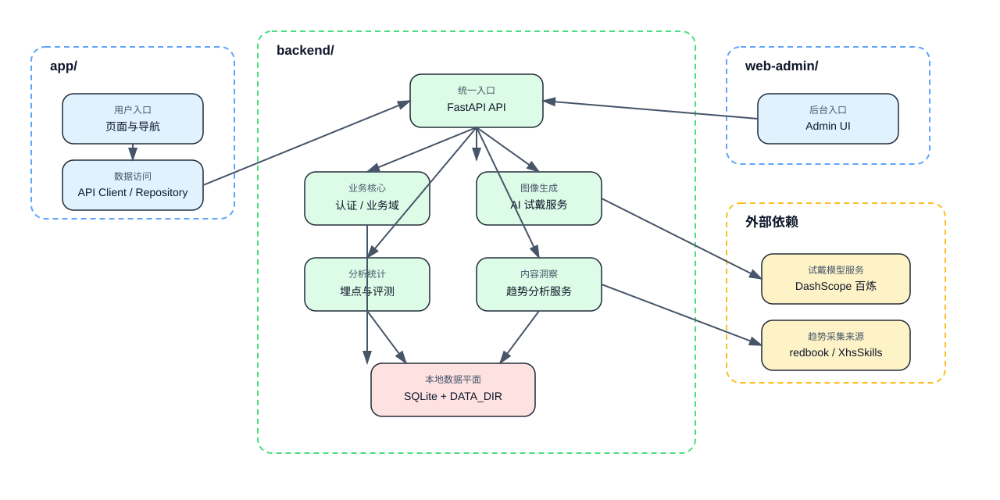
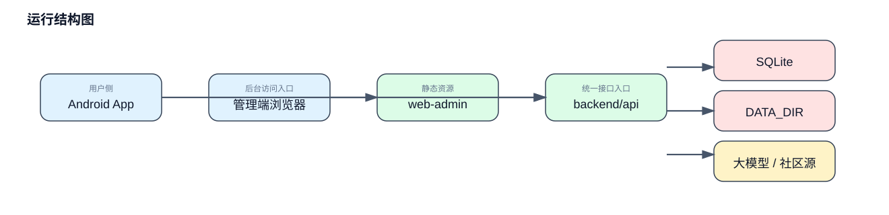
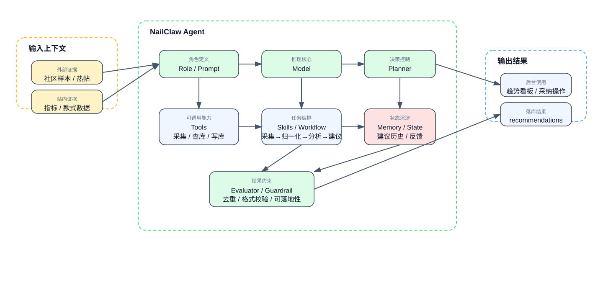
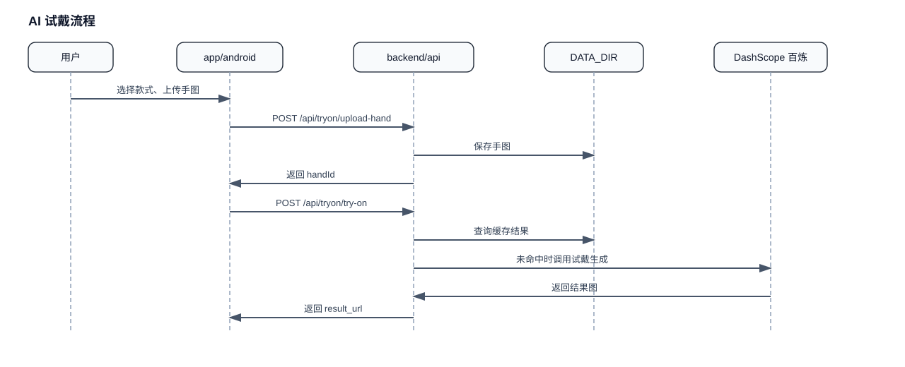
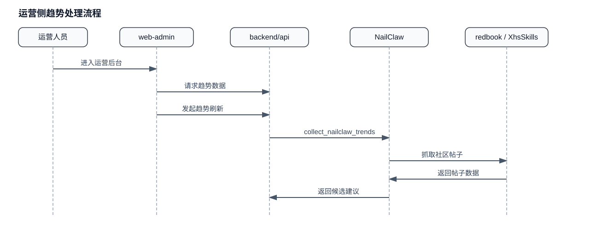
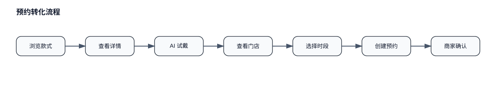
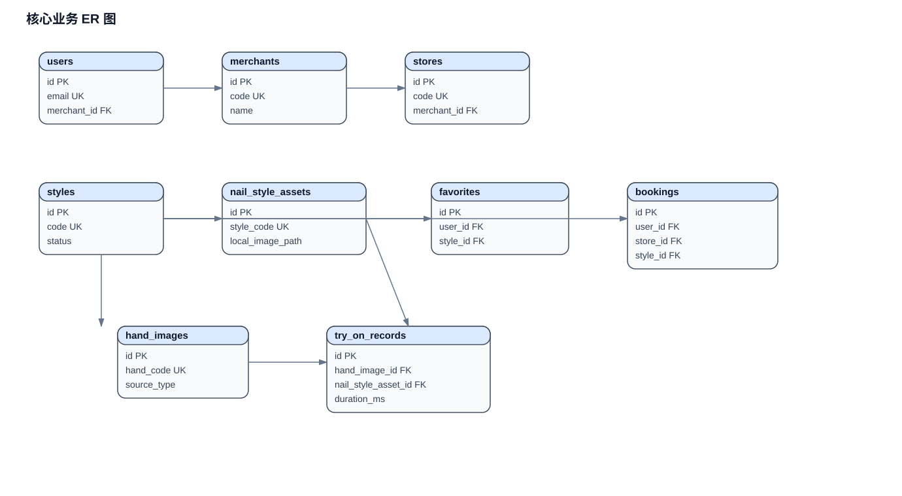
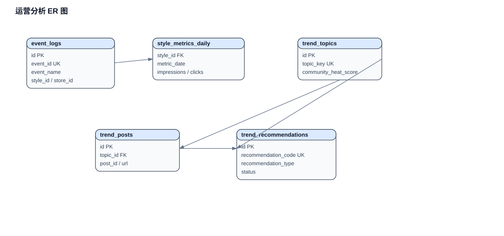

# NailMind 方案设计文档

## 1. 需求背景

NailMind 面向两个场景：用户选款和平台运营。对用户来说，最难的是下单前没有直观的上手效果，看到款式图以后，还是很难判断是否适合自己。对商家和运营来说，问题又不一样。商家关心门店款式、预约和库存，运营关心哪些款式值得推，哪些款式该下架，后台还要能看清试戴和预约转化。

项目按三个目录拆开以后，结构已经比较明确：`app/` 负责用户侧移动端，`backend/` 负责业务和数据，`web-admin/` 负责商家与运营后台。这份文档就按这三部分来展开，把整体结构、核心流程、数据表关系和评测结果梳理清楚。

## 2. 需求分析

从业务上看，这个系统至少要同时满足三类需求。

- 用户侧需要完成浏览、试戴、收藏和预约，流程要顺，返回结果要快。
- 商家侧需要管理门店款式和预约，但权限要收住，只能看到自己的门店数据。
- 运营侧需要看到真实的埋点、试戴质量和趋势建议，方便做上新、加推和下架决策。

落到系统设计上，三个目录的分工也就清楚了。`app/` 主要处理用户交互和 API 调用，`backend/` 负责业务规则、数据库和 AI 试戴，`web-admin/` 提供后台操作入口。第三方能力，比如大模型和社区内容抓取，也都通过 `backend/` 接进来。

## 3. 架构设计

### 3.1 组件关系

这一节只保留最核心的结构。`app/` 和 `web-admin/` 作为两个入口，统一访问 `backend/`；后端内部再分成业务服务和能力服务两层，下面接数据存储，右侧接外部能力。这样能先看清主链路，再去展开细节。

### 3.2 运行结构

从运行方式看，`backend/api` 是主服务，承担 API 路由、业务编排和数据读写；`web-admin/` 提供静态页面资源；`app/` 和后台浏览器都通过接口访问后端。当前数据平面还是单机式的 `SQLite + DATA_DIR`，更适合演示和比赛环境，结构简单，调试方便。

### 3.3 NailClaw 架构

`NailClaw` 是这套系统里和运营价值最直接相关的模块，所以单独拆开来看更合适。它的职责不是出图，而是把社区内容采集、样本归一化、趋势分析和建议回写串成一条链路。外部数据源先通过 Provider 接入，`collect_nailclaw_trends` 负责统一收口，`NailClawAgent` 再结合站内数据生成候选建议，最后写入 `trend_topics`、`trend_posts` 和 `trend_recommendations`，供 `web-admin` 查看、采纳和回写。

## 4. 核心流程

### 4.1 AI 试戴流程

这条链路从用户选款开始，先上传手图，再进入试戴接口。后端会先查缓存，命中时直接返回结果，没命中再调用大模型生成结果图。生成后的图片会落到本地目录，同时写入试戴记录，供历史查看和后续评测使用。

### 4.2 运营侧趋势处理流程

后台这条链路由 `web-admin/` 发起，核心逻辑在 `backend/`。运营先查看已有趋势数据，需要刷新时再触发 NailClaw 去抓取社区帖子，整理出候选建议，然后回写到后端。这样商家端和运营端都只面对业务结果，不需要直接碰采集细节。

### 4.3 预约转化流程

这条流程把用户浏览、试戴和门店预约接在一起。用户在 `app/` 里完成选款和试戴后，能顺着同一条路径继续看门店、选时段、提交预约，最后由商家在 `web-admin/` 里确认。这也是整个项目里最关键的一条业务闭环。

## 5. 数据表设计

数据库模型定义在 `backend/api/app/models.py`。这里不再把全部数据表塞进一张图里，而是拆成核心业务和运营分析两部分。

### 5.1 核心业务表

这一部分覆盖用户、门店、款式、收藏、预约和试戴记录，主要服务于用户下单链路和商家履约链路。

### 5.2 运营分析表

这一部分覆盖事件埋点、日指标、趋势主题、帖子样本和候选建议，主要服务于后台分析和趋势推荐。

表结构可以概括成两组：

- 核心业务：`users`、`merchants`、`stores`、`styles`、`favorites`、`bookings`、`hand_images`、`nail_style_assets`、`try_on_records`
- 运营分析：`event_logs`、`style_metrics_daily`、`trend_topics`、`trend_posts`、`trend_recommendations`

这样拆开以后，主业务链路和分析链路会更清楚，也更方便在答辩时逐段说明。

## 6. 评测结果

评测数据主要来自 `backend/命题三美甲评测数据（对外版）.xlsx` 和后端运行记录。Excel 数据集提供了手图、款式图和增强后款式图样本，导入后会进入后端素材库。真正的评测指标则来自后端落库的试戴记录和质量评测事件。

当前重点看的指标有三类：

- 试戴平均时延
- 款式还原度
- 手工一致性

现有测试里已经覆盖了一组可复现样例：

| 指标 | 样例值 |
| --- | --- |
| 平均试戴时延 | `10000 ms` |
| 样本数 | `2` |
| 置信水平 | `99%` |
| 款式还原度 | `0.93` |
| 手工一致性 | `0.88` |

这组结果至少说明两件事。第一，评测逻辑已经写进 `backend/`，不是只停在文档层面。第二，现有三仓结构能够支撑从用户试戴到后台分析的整条链路，数据口径也是接得上的。

## 7. 小结

按 `app/`、`backend/`、`web-admin/` 这三个目录来理解项目，会比沿用旧的单仓思路清楚很多。`app/` 负责用户入口，`backend/` 承担业务和数据，`web-admin/` 对应后台操作，这三部分各自边界明确，配合关系也比较稳定。对于现在这套项目来说，这样的拆分已经足够支撑演示、答辩和后续继续开发。
