# NailMind 方案设计文档

本文以当前工作区和当前部署状态为准。`app/`、`backend/`、`web-admin/` 分别对应 Android 客户端、业务后端和后台 Web。`inference/` 保留 GPU 推理代码，但 GPU 实例平时不开机，当前试戴默认使用 GPT Image 2。

| 状态 | 含义 |
|---|---|
| 已实现 | 仓库中已有页面、接口、数据结构或测试 |
| 依赖环境 | 代码已经接入，运行需要模型密钥、社区登录态或 GPU |
| 后续演进 | 当前版本尚未落地 |

## 1. 项目背景与目标

### 1.1 要解决的问题

| 角色 | 当前问题 | 产品处理方式 |
|---|---|---|
| 消费用户 | 款式图好看，但无法判断放到自己手上的效果 | 小美导购、AI 试戴、收藏和预约 |
| 门店商家 | 价格、库存、档期、咨询和预约分散 | 商家工作台统一维护门店供给 |
| 平台运营 | 社区趋势变化快，站内漏斗靠人工整理 | NailClaw 发现趋势，Ops Assistant 分析转化 |

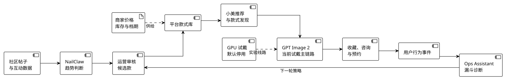

### 1.2 产品目标

| 目标 | 验证方式 |
|---|---|
| 用户更快看到本人上手效果 | 记录生成耗时和试戴成功率 |
| 当前部署不依赖常开 GPU | GPT Image 2 独立完成试戴生成 |
| 趋势建议可以复核 | 每条建议保留原帖、图片和互动证据 |
| 运营动作可控 | 写操作使用白名单，并由运营确认 |
| 建议执行后可以复盘 | 按款式编号继续观察点击、试戴和预约 |

### 1.3 模型调研与选择

| 方案 | 实际观察 | 当前用途 |
|---|---|---|
| 豆包图像模型 | 响应快，部分结果会让皮肤发亮 | 前期对比 |
| Nano Banana | 生成质量好，国内代理与费用需要额外处理 | 效果对照 |
| Qwen Image 2.0 Pro | 效果与速度较均衡，国内 API 接入方便 | 趋势候选款商品图 |
| GPT Image 2 | 手部和背景保持较好，适合参考图编辑 | 当前试戴主线路 |
| 独立 GPU 局部推理 | 甲面区域可控，但需要单独维护 GPU 实例 | 代码保留，默认停用 |
| Qwen3.7-Plus | 支持文字、图片理解和结构化输出 | 三个 Agent 与试戴质检 |

## 2. 总体架构

### 2.1 三端业务架构

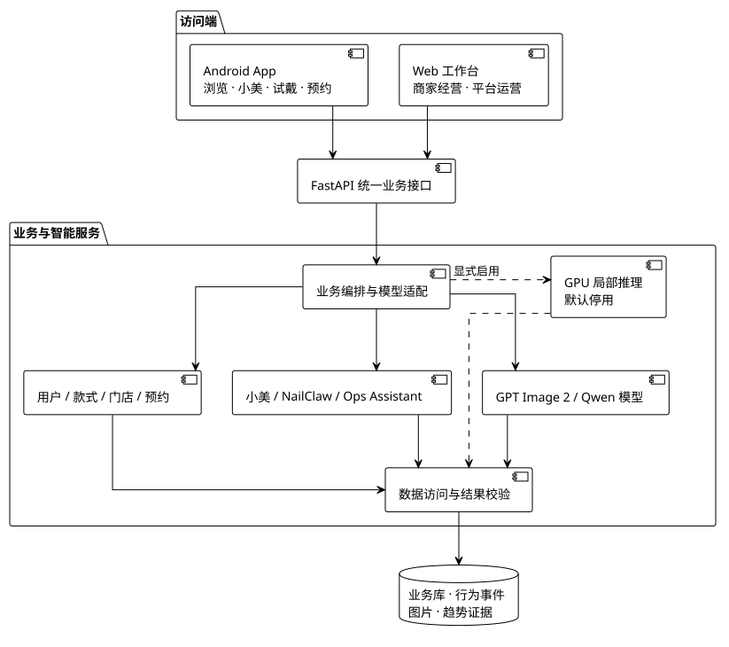

### 2.2 系统分层

| 层次 | 组成 | 职责 |
|---|---|---|
| 交互层 | Android App、运营与商家 Web | 页面交互、结果展示、任务轮询 |
| 业务层 | 用户、款式、门店、供给、预约、试戴任务 | 权限检查、业务规则、数据聚合 |
| Agent 层 | 小美、NailClaw、Ops Assistant | 理解目标、准备上下文、调用工具 |
| 模型层 | GPT Image 2、Qwen Image、Qwen3.7-Plus，保留 GPU 实验线路 | 图像生成、多模态理解和可选本地推理 |
| 数据层 | 业务数据、事件、图片、趋势证据 | 保存状态和分析依据 |

### 2.3 模型与业务边界

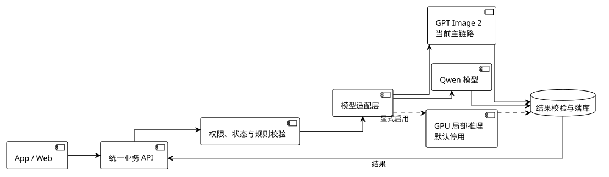

客户端不直接调用模型服务。底层模型替换时，App 和 Web 接口保持不变。

## 3. 当前 AI 试戴方案

### 3.1 当前生成时序

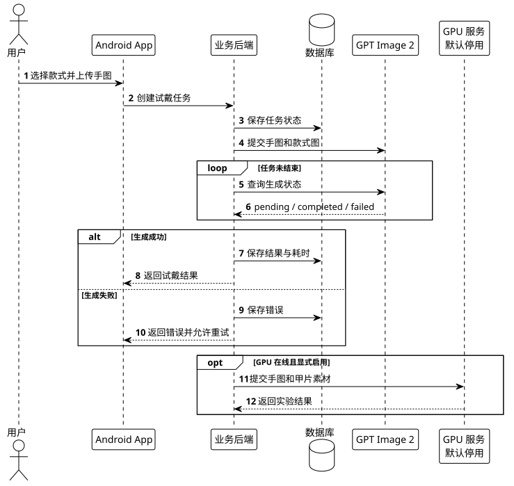

GPU 分支仍保留在代码中，只有 GPU 服务在线且显式启用时才参与生成。当前部署不把它作为默认可用线路。

### 3.2 任务状态

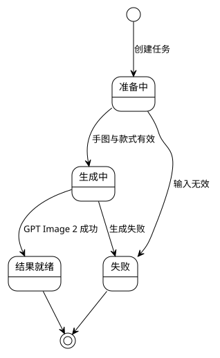

| 当前结果情况 | 用户看到的内容 | 主任务结果 |
|---|---|---|
| GPT Image 2 成功 | 显示一张试戴结果 | 完成 |
| GPT Image 2 失败 | 显示错误并允许重试 | 失败 |
| 显式启用 GPU 实验线路 | 按实际完成情况记录额外结果 | 非默认部署场景 |

### 3.3 生成耗时

```text
当前部署的试戴耗时 = GPT Image 2 结果的 duration_ms
```

| 指标 | 口径 |
|---|---|
| 试戴耗时 | 从任务开始到 GPT Image 2 结果完成的时间 |
| 生成成功率 | GPT Image 2 成功任务数除以总任务数 |
| GPU 实验数据 | 仅在显式启用 GPU 时单独记录，不进入默认口径 |

### 3.4 保留的 GPU 实验路线

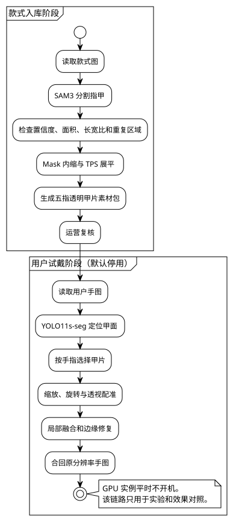

| 后端 | 当前定位 |
|---|---|
| `local_inpaint` | 仓库提供的生产环境示例 |
| `reference_local_edit` | 可选参考图增强线路 |
| FLUX.2 Klein | 评测中的可选线路 |

这套链路保留用于实验和效果对照。由于 GPU 实例平时不开机，产品演示和日常试戴不依赖它。

### 3.5 GPT Image 2 路线

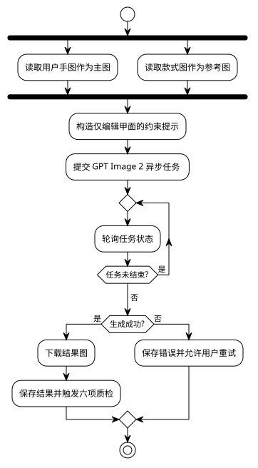

提示词要求迁移颜色、图案、甲型、长度、装饰和光泽，同时保留手型、肤色、姿势、背景、光线和构图。模型仍可能重绘非甲面区域，因此结果会进入质检。

### 3.6 结果质检

| 检查项 | 判断内容 |
|---|---|
| 款式还原 | 颜色、纹理、装饰和整体风格是否接近目标款式 |
| 甲面贴合 | 图案是否落在甲面内，边缘是否自然 |
| 手指数量 | 是否出现多指、少指或结构错误 |
| 皮肤保持 | 肤色和皮肤质感是否明显变化 |
| 姿态保持 | 手型、方向和构图是否被大幅改动 |
| 背景保持 | 原背景是否被无关内容替换 |

质检在生成结果返回后异步执行，不延长用户等待结果的时间。

### 3.7 当前任务执行限制

| 当前实现 | 风险 | 后续演进 |
|---|---|---|
| FastAPI 进程内后台任务 | 服务在生成期间退出时需要重试 | 迁移到持久化任务队列 |
| 数据库保存任务与结果状态 | 可以查询历史状态，但不能恢复已中断的执行器 | 独立 Worker 领取和续跑任务 |

## 4. 三个 Agent

### 4.1 分工

| Agent | 输入 | 工具范围 | 输出 |
|---|---|---|---|
| 小美 | 对话、偏好、最近手图、在架款式 | 手图分析、知识检索、款式检索、App 入口 | 回复、分析、款式卡片和跳转入口 |
| NailClaw | 社区帖子、图片、互动量、款式库 | 采集、证据检查、款式匹配、候选图生成 | 趋势证据、加推建议或新款候选 |
| Ops Assistant | 曝光、点击、收藏、试戴、预约 | 指标查询、首页推荐、款式状态、推荐组 | 经营诊断、待确认方案和执行结果 |

### 4.2 共同运行约定

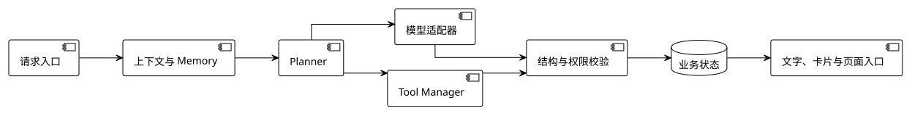

Planner、模型适配器、Tool Manager 和 Memory 是共同约定，每个 Agent 在自己的目录中实现这些职责。模型不能绕过工具层改变款式、候选款或推荐位。

### 4.3 记忆和流式输出

| Agent | 短期记忆 | 持久数据 |
|---|---|---|
| 小美 | 最近 8 条有效对话、偏好、手图和上一轮分析 | 用户资料、手图和行为记录 |
| NailClaw | 当前不额外保存会话状态 | 趋势主题、原帖、候选款和建议 |
| Ops Assistant | 最近的分析与执行摘要 | 日指标、推荐组、动作结果和事件 |

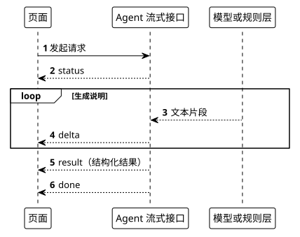

### 4.4 小美

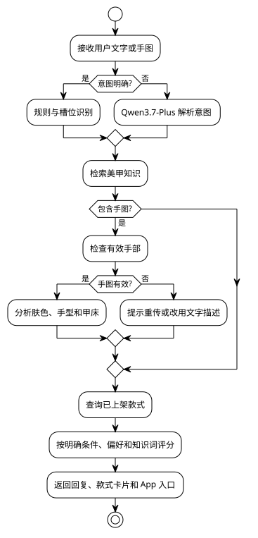

模型不可用时，明确意图路由、知识检索和款式匹配仍由规则完成。手图无效时，App 引导用户重传或改用文字描述。

### 4.5 NailClaw

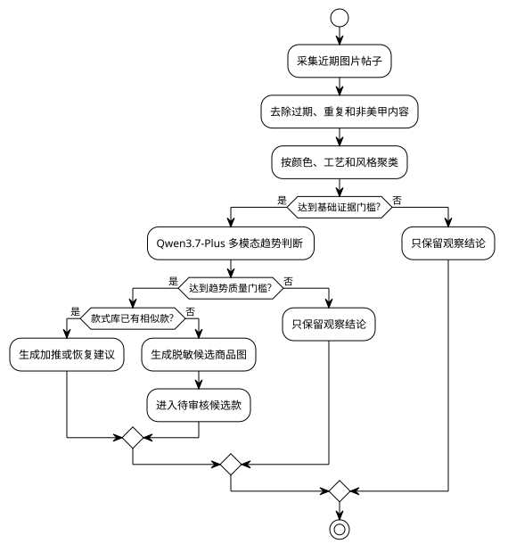

| 门槛 | 当前值 |
|---|---:|
| 不同帖子数 | 至少 2 条 |
| 可复核图片 | 至少 1 张 |
| 最高点赞 | 至少 100 |
| 综合互动 | 至少 500 |
| 有效参考图 | 至少 2 张 |
| 甲面可见度 | 不低于 0.70 |
| 跨帖一致性 | 不低于 0.60 |
| 商业复刻度 | 不低于 0.65 |

综合互动按“点赞 + 2 × 收藏 + 3 × 评论”计算。候选图不会直接使用原帖人物图，原帖只作为运营复核证据。

### 4.6 Ops Assistant

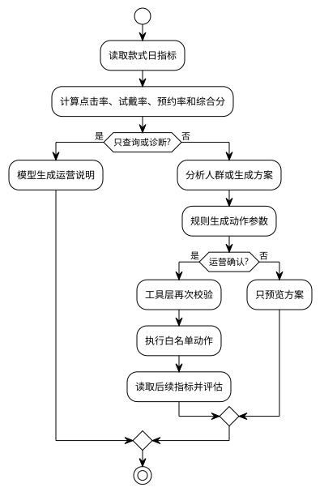

| 可写操作 | 约束 |
|---|---|
| 修改款式状态 | 款式必须存在，状态迁移合法 |
| 调整首页推荐位 | 款式已上架并有展示图 |
| 创建或更新人群推荐组 | 排序、周期和流量参数合法 |

场景分类由款式标签决定，Agent 不能把款式直接写入“通勤”或“约会”等分类。

### 4.7 输出和权限约束

| 位置 | 处理方式 |
|---|---|
| 模型输入 | 只传当前任务需要的对话、图片、指标和候选款 |
| 模型输出 | 固定 JSON 字段，检查枚举、分数、数量和工具名 |
| 数据读取 | 每个 Agent 只读自己的业务范围 |
| 数据写入 | NailClaw 只建待审核候选，Ops 写操作需要运营确认 |
| 失败处理 | 小美回到规则结果，NailClaw 停止建候选，Ops 返回规则诊断 |

## 5. 数据回流与验证

### 5.1 数据回流

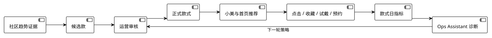

候选款、正式款式和行为指标通过款式编号关联，运营可以检查一次上新或加推后的实际变化。

### 5.2 指标口径

| 观察对象 | 指标 |
|---|---|
| 用户 | 试戴发起率、生成耗时、试戴后收藏率、试戴后预约率 |
| 模型 | GPT Image 2 成功率、耗时、款式还原、甲面贴合、手部与背景保持；GPU 实验数据单独统计 |
| NailClaw | 证据完整率、候选通过率、候选入库后的转化 |
| Ops Assistant | 诊断与真实指标一致性、动作执行结果、执行后变化 |

### 5.3 验证矩阵

| 验证对象 | 场景 | 检查内容 |
|---|---|---|
| 当前试戴 | GPT Image 2 成功、失败、超时和重试 | 结果展示、生成耗时和错误提示 |
| GPU 实验线路 | GPU 在线且显式启用 | 不影响默认试戴，结果与错误单独记录 |
| 图像质量 | 固定手图和固定款式 | 六项质检和隐藏模型名称的人工对比 |
| 小美 | 明确意图、模糊意图、有效手图、无效手图 | 路由、推荐、降级和 App 入口 |
| NailClaw | 证据不足、已有相似款、新趋势 | 停止建候选、加推建议、新候选 |
| Ops Assistant | 查询、诊断、生成方案、确认执行、复盘 | 指标准确性、动作白名单和权限 |

仓库已有基准脚本、推理样例和自动化测试。平均耗时、成功率和质量分必须来自同一版本、同一批样本；没有有效样本时显示“待评测”。

## 6. 完整演示路径

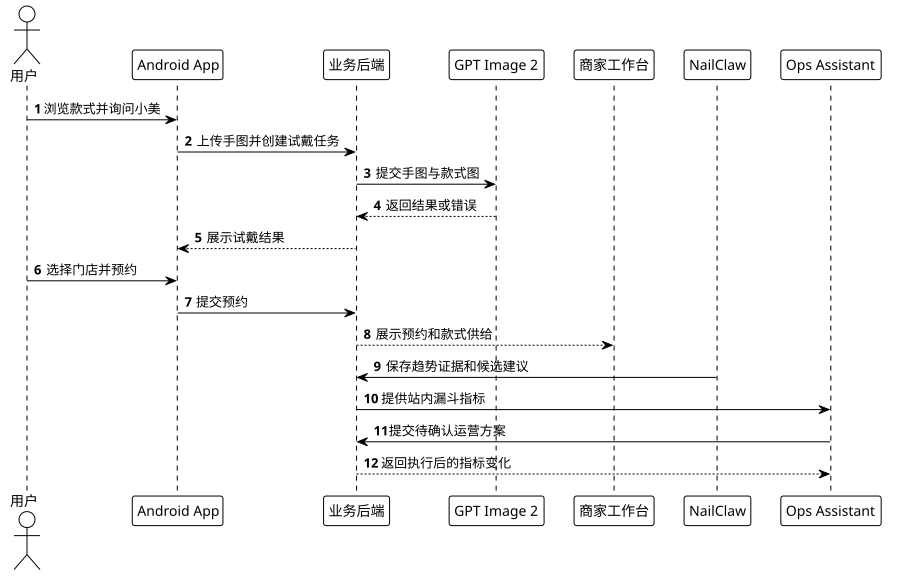
