# NailMind 智慧美甲平台方案设计文档

> 黑客松参赛项目 · 方案设计稿
>
> 文档版本：V1.0
>
> 编制日期：2026-07-10
>
> 适用范围：用户端、商家端、运营端、AI 试戴服务与智能运营 Agent

---

## 文档说明

本文件用于向评委完整说明 NailMind 为什么做、为谁做、如何运转、系统如何实现，以及后续如何评测和迭代。文档不照搬通用内部模板，而是围绕本项目最重要的两条价值链组织内容：

1. 让用户从“浏览款式”自然走到“看到上手效果—选择门店—完成预约”；
2. 让运营从“感知外部趋势与站内行为”自然走到“生成建议—人工审核—执行策略—观察结果”。

为避免把目标方案误写成既成事实，全文采用以下状态口径。

| 标识 | 含义 | 判定方式 |
|---|---|---|
| **已实现** | 当前代码中已经存在对应页面、接口、模型或流程 | 可在仓库中定位到实现 |
| **环境依赖** | 代码已接入，但效果依赖模型密钥、社区登录态、GPU 或部署参数 | 需要比赛环境联调 |
| **演进设计** | 为生产化给出的下一阶段方案 | 不作为当前版本完成度宣称 |

### 阅读导航

1. 项目背景与目标
2. 行业与模型对标
3. 需求分析
4. 业务架构设计
5. 系统架构设计
6. 核心领域与数据设计
7. 关键功能设计
8. 接口与权限设计
9. 安全、隐私与 Agent 治理
10. 性能、可靠性与可观测性
11. 测试、评测与验收设计
12. 部署与运维设计
13. 当前完成度、风险与迭代路线

---

## 0. 执行摘要

NailMind 不是一个孤立的“上传两张图后生成一张图”的 AI Demo，而是一套面向美甲消费决策和门店经营的三端业务系统。

- **用户端**以 Android App 为入口，覆盖注册登录、首页推荐、款式搜索与筛选、收藏、AI 试戴、小美咨询、门店咨询、到店预约、个人记录和 DIY 交互原型。
- **商家端**以 Web 工作台为入口，覆盖入驻申请、门店资料与档期、门店款式和库存查看、用户咨询、预约查看以及上架/下架申请；价格库存写接口已具备，当前 Web 尚未接入。
- **运营端**与商家端共用 Web 工作台但按角色隔离，覆盖批量上款、AI 标签、五甲片素材生成、款式生命周期、试戴质检、商家审核、趋势雷达、候选款池、漏斗分析和经营策略执行。

系统通过四个智能能力形成闭环：

- **AI 试戴**：把用户真实手图与目标款式结合，尽量只修改甲面，不改变手指、肤色、姿态和背景；
- **NailClaw 趋势 Agent**：采集并归一化社区样本，以证据门槛过滤噪声，再生成可审核的趋势候选；
- **Ops Assistant 运营助手**：读取站内曝光、点击、收藏、试戴、预约指标，以确定性规则形成动作，再由大模型解释策略；
- **小美用户助手**：理解文本或手图意图，结合美甲知识库和在架款式提供咨询、推荐与 App 页面入口。

项目的关键差异不在于“用了一个大模型”，而在于把模型放进了可控业务流程：数据有来源、建议有证据、动作有白名单、执行有人审、效果有埋点、问题可降级。

---

## 1. 项目背景与目标

### 1.1 赛题背景

美甲服务同时存在消费侧和经营侧两类信息断层。

在消费侧，平台可以提供数百款精美图片，但图片只能说明“款式本身好看”，不能回答“放到我的手上是否好看”。肤色、手型、甲面长度、拍摄光线都会影响最终观感。用户若必须先到店试色，决策成本过高；如果只凭想象下单，又担心不适合，最终容易反复浏览、延迟决策甚至放弃预约。

在经营侧，平台和门店掌握大量款式，但热门趋势变化快。单纯看经验，难以及时发现社区正在上升的颜色、工艺和风格；单纯看站内曝光，又无法判断是款式本身不受欢迎，还是首图、供给、试戴入口或门店档期造成的转化断点。人工每天汇总数据不仅慢，也很难持续保持统一口径。

因此，赛题要求的并不是两个互不相干的功能，而是一套完整闭环：

```text
用户看见真实效果 → 更快做出选择 → 产生真实行为数据
        ↑                              ↓
款式与推荐策略更新 ← 运营审核并执行 ← AI 识别趋势与转化断点
```

### 1.2 核心问题拆解

| 角色 | 现状问题 | 直接后果 | NailMind 的解法 |
|---|---|---|---|
| 用户 | 无法预判款式与本人肤色、手型的适配效果 | 决策时间长、放弃率高 | AI 试戴、小美咨询、收藏对比 |
| 用户 | 选款与门店预约割裂 | 看完仍需重新查门店、问价格和档期 | 款式—门店供给—咨询—预约连续链路 |
| 商家 | 款式、库存、档期、咨询分散处理 | 承接效率低、热门款准备不足 | 单店工作台、库存与档期维护、预约和咨询聚合 |
| 运营 | 社区热点靠人工发现，更新滞后 | 错过上新和加推窗口 | NailClaw 采集、证据筛选、候选建议 |
| 运营 | 只看曝光或销量，难定位漏斗断点 | 推荐策略粗放 | Ops Assistant 基于全漏斗诊断和白名单动作 |
| 平台 | 生成结果好坏缺少统一判定 | 无法持续优化模型 | 六维 AI 质检、人工复核、聚合指标 |

### 1.3 项目目标

#### 1.3.1 业务目标

1. 缩短用户从首次查看款式到确定意向款的时间；
2. 提高“款式详情 → 试戴 → 预约”的漏斗转化；
3. 将运营从人工找热点、手工汇总数据，升级为“AI 初筛 + 人工决策”；
4. 让商家能及时接收平台策略并调整库存、档期和可售款式；
5. 用真实用户行为反哺推荐与款式生命周期，形成持续迭代闭环。

#### 1.3.2 产品目标

| 方向 | 比赛版验收目标 | 说明 |
|---|---:|---|
| 试戴可用性 | 有效手图可完成“上传—生成—查看结果”闭环 | 包含异常反馈和历史记录 |
| 试戴时效 | 生成链路目标 P50 ≤ 10 秒；缓存命中尽量秒级返回 | 为目标值，最终以压测记录为准 |
| 试戴质量 | 六项质检全部达标才判定通过 | 还原度、贴合、手指数、皮肤、姿态、背景 |
| 趋势时效 | 支持一键刷新，并可配置每日自动运行 | 当前定时任务默认关闭，按环境启用 |
| 建议可信度 | 每条外部趋势建议必须能追溯到样本证据 | 无充分证据不进入候选款池 |
| 操作安全 | AI 经营动作必须经过运营确认 | 演示数据禁止写入真实款式库 |
| 权限隔离 | 商家只能访问其绑定门店，运营管理平台全局 | 由角色和门店范围共同控制 |

#### 1.3.3 技术目标

- 保持 App、Web、业务 API、GPU 推理服务职责分离；
- 用统一 API 屏蔽底层图像模型替换，降低模型迁移成本；
- 用缓存、持久化任务和结果记录控制模型费用与重复请求；
- 用事件明细和日聚合支持漏斗、热度、质量和策略复盘；
- 用结构化输出、工具白名单、证据阈值和人工审核约束 Agent；
- 为后续 MySQL、Redis/任务队列、对象存储和多实例部署保留演进路径。

### 1.4 建设范围

**本期范围**：

- 用户注册登录、款式发现、收藏、试戴、咨询、门店与预约；
- 商家入驻、资料、档期、款式供给、库存、咨询、预约和生命周期申请；
- 运营款式入库、AI 标签、甲片素材、质检、商家审核、趋势与经营策略；
- 外部社区趋势采集、站内行为聚合、Agent 分析与人工审批；
- Qwen 模型调用和独立 GPU 推理服务；
- 比赛评测数据、接口测试、质量指标与演示部署。

**本期不扩展**：

- 在线支付、退款、发票和完整财务结算；
- 复杂排班、技师绩效与供应链采购；
- 对用户手型或健康状况作医疗判断；
- 未经平台确认由 Agent 自动发布商品或对外发送营销内容。

### 1.5 设计原则

1. **效果可见**：试戴结果是消费决策工具，不是单纯的图片生成展示；
2. **原图优先**：只允许修改可见甲面，手指、皮肤、姿态、背景应尽量保持；
3. **证据优先**：外部趋势没有足够帖子、图片和互动数据时不生成强建议；
4. **规则托底**：关键阈值、状态迁移和可执行动作由确定性代码控制；
5. **人机协同**：模型负责理解、归纳和建议，人负责审核高影响动作；
6. **三端闭环**：用户需求、商家供给、运营策略必须通过同一业务数据相互连接；
7. **诚实评测**：没有样本时展示“待评测”，不以静态演示数字冒充真实结果。

---

## 2. 行业与模型对标

### 2.1 对标方法

项目组在探索试戴能力时，使用相同或相近的手图、款式图和约束提示，对多类先进图像生成/编辑模型进行比较。对标不只看“第一眼是否惊艳”，还观察以下维度：

- 款式颜色、纹理、法式边、猫眼、钻饰等细节还原；
- 手指数量、手型、肤色、皮肤纹理、光照和背景是否保持；
- 甲面边缘、透视、遮挡和高光是否自然；
- 首次响应与整体耗时；
- 国内网络、API 稳定性、代理链路和运维复杂度；
- 单次生成成本、并发限制与规模化可控性；
- 是否具备多模态理解能力，能否与 Agent 共用供应商和鉴权体系。

以下结论是项目组在特定样本和接入环境中的工程观察，不代表对模型通用能力的绝对排名。

### 2.2 候选模型对比

| 候选方案 | 项目组观察到的优势 | 项目组观察到的问题 | 工程判断 |
|---|---|---|---|
| 豆包图像模型 | 响应较快，适合快速预览 | 部分样本中皮肤被重绘后发亮，手部质感与原图偏离，细节稳定性不足 | 可作为低时延探索项，不作为当前主链路 |
| GPT 图像能力 | 综合观感和指令理解较好，复杂款式表现较稳 | 国内接入、代理稳定性和持续费用存在不确定性 | 效果优秀，但比赛落地成本较高 |
| Nano Banana | 编辑自然度和整体效果较好 | 国内代理、费用、可用性与供应链风险需要额外处理 | 适合效果对照，不作为当前主供应商 |
| **Qwen Image 2.0 Pro** | 效果与速度较均衡，国内 API 接入方便，多模态生态完整 | 纯生成模式仍可能重绘非甲面区域，需要工程约束与质检 | **比赛版最终选择** |
| 可控本地融合链路 | 甲面区域可控、手部身份保持更稳定，模型可替换 | 需要 GPU、分割权重、素材预处理和更多工程投入 | 作为 Qwen 主方案的质量增强与可控推理路径 |

### 2.3 最终模型组合

项目最终采用“统一 Qwen 生态 + 可控局部推理”的组合，而不是把全部职责压给单一模型。

| 能力 | 当前选型 | 主要职责 |
|---|---|---|
| 试戴图片生成基线/显式切换路径 | `qwen-image-2.0-pro` | 根据手图和款式图生成试戴结果；不是 GPU 请求失败后的自动回退 |
| 款式五甲片素材生成 | `qwen-image-2.0-pro` | 从款式原图生成透明背景的拇指至小指素材包 |
| 趋势与运营 Agent | `qwen3.7-plus` | 结构化趋势建议、经营诊断文案 |
| 用户侧小美与多模态分析 | `qwen3.7-plus` | 文本理解、手图理解、回复润色 |
| 试戴质量评估 | `qwen3.7-plus` | 对手图、款式图、结果图作六维判定 |
| 指甲分割 | YOLO11s-seg | 在用户手图中定位可见甲面 |
| 局部融合 | 几何配准 + SDXL Inpaint；可选 Reference Adapter | 只在甲面及边缘局部修复，保持原手图 |

选择 Qwen 系列的主要原因是：图像模型和多模态大模型可以共用 DashScope/API Key 和调用体系；国内部署与网络路径更短；费用和配额更容易统一管理；图像生成、图片理解、结构化文本输出均能覆盖；团队只需维护一套主要供应商适配层。

### 2.4 从“整图生成”到“局部可控编辑”

仅靠提示词要求模型“不改变手”，仍可能出现多指、少指、肤色变化、背景重绘或甲片漂浮。为此，在**独立 GPU 可控路径**中，系统增加了以下处理：

1. 款式入库时先生成并复核五枚透明甲片素材；
2. 用户试戴时用 YOLO11s-seg 定位真实甲面；
3. 将对应甲片按透视或 TPS/曲面网格方式配准到每个甲面；
4. 做光照匹配、细节保留、alpha 羽化和高光处理；
5. 只裁剪甲面附近局部区域交给 Inpaint 修边；
6. 再把局部结果融合回原分辨率手图。

这条 GPU 链路把生成模型从“重画整只手”降级为“修复局部融合”，降低了生成自由度，也降低了手部结构被破坏的概率。默认 Qwen 基线路径仍将完整手图和完整款式图发送给云模型，不执行上述 YOLO/SDXL 管线。

### 2.5 已有分割基线

仓库记录的首版 YOLO11s-seg 训练结果如下。该数据用于证明指甲定位链路具备可验证基础，不等同于最终端到端试戴成绩。

| 指标 | 结果 |
|---|---:|
| 训练轮数 | 120 epochs |
| 验证图片 / 实例 | 677 / 3102 |
| Box mAP50 | 0.986 |
| Mask mAP50 | 0.979 |
| Mask mAP50-95 | 0.788 |
| 单图模型推理 | 约 2.1 ms |
| 训练耗时 | 约 3.391 小时（RTX 5090） |

现有数据集包含单甲、甲片模板和真实手图混合样本。正式上线前仍需补充 App 真实上传的复杂姿势、低光、遮挡和低清样本作二次微调。

---

## 3. 需求分析

### 3.1 角色与职责

| 角色 | 核心诉求 | 系统责任 | 数据范围 |
|---|---|---|---|
| 消费用户 `customer` | 快速找到适合自己的款式并放心预约 | 个性化发现、试戴、收藏、咨询、预约 | 仅本人账户、图片、试戴、收藏、会话和预约 |
| 商家管理员 `merchant_admin` | 经营门店并承接平台用户 | 店铺资料、款式库存、档期、咨询、预约、申请 | 绑定商户及门店 |
| 商家员工 `merchant_staff` | 处理日常门店业务 | 与商家管理员相近，后续可继续细分写权限 | 绑定门店 |
| 平台运营 `platform_admin` | 管全局供给、质量、趋势和策略 | 款式、审核、质检、趋势、分析、Agent 动作 | 平台全局 |
| 内部 Worker | 异步执行试戴任务 | 领取、更新进度、完成或失败 | 仅内部任务接口 |

### 3.2 用户端功能需求

| 编号 | 功能 | 关键业务规则 | 优先级 |
|---|---|---|---|
| U-01 | 注册、登录、退出与个人信息 | Bearer Token 与服务端会话同时有效才可访问 | P0 |
| U-02 | 首页与款式浏览 | 只展示已上架且有真实图片的款式 | P0 |
| U-03 | 搜索、标签筛选和榜单 | 支持甲型、效果、风格、场景等标签 | P0 |
| U-04 | 款式详情与收藏 | 收藏按“用户 + 款式”唯一，重复操作幂等 | P0 |
| U-05 | 上传/拍摄手图 | 仅接收允许的图片格式，失败给出可理解反馈 | P0 |
| U-06 | 异步 AI 试戴 | 创建任务后可查看阶段、进度、结果或失败原因 | P0 |
| U-07 | 试戴历史与重新生成 | 结果关联本人和款式；重生成创建新的渲染过程 | P1 |
| U-08 | 小美咨询 | 闲聊不强制推荐；有手图时先判断是否存在有效手部 | P1 |
| U-09 | 门店查看与咨询 | 用户会话必须绑定目标门店，商家只能读本店会话 | P0 |
| U-10 | 预约 | 款式已上架、门店在售、库存大于 0、档期有效才可创建 | P0 |
| U-11 | DIY 款式创作 | 选择甲型和视觉元素形成个性化设计，并可保存/进入试戴 | P2，当前为交互原型 |

### 3.3 商家端功能需求

| 编号 | 功能 | 关键业务规则 | 优先级 |
|---|---|---|---|
| M-01 | 商家登录与角色工作台 | 非商家角色不可访问商家接口 | P0 |
| M-02 | 门店入驻申请 | 同一账号只能有一条待审核申请 | P0 |
| M-03 | 店铺资料与营业设置 | 维护档期和是否接受预约；草稿可保存在浏览器 | P0 |
| M-04 | 门店款式、价格与库存 | 只能修改绑定门店的 listing | P0 |
| M-05 | 上架/下架申请 | 目标规则为商家提交原因、运营审核后改变状态；当前 Web 走该流程，但后端 Listing PATCH 仍存在绕过缺口 | P0 |
| M-06 | 用户咨询 | 仅能查看和回复本门店会话 | P0 |
| M-07 | 预约管理 | 查看到店时段、用户信息和履约状态 | P0 |
| M-08 | 经营看板 | 查看门店曝光、试戴、预约趋势和待办 | P1 |

### 3.4 运营端功能需求

| 编号 | 功能 | 关键业务规则 | 优先级 |
|---|---|---|---|
| O-01 | 款式库与生命周期 | 草稿、上架、下架；下架后取消首页推荐 | P0 |
| O-02 | 批量上款 | 每张图建立独立持久化任务，先进入草稿 | P0 |
| O-03 | AI 自动标签 | 输出必须落入受控甲型、效果、风格、场景和颜色体系 | P1 |
| O-04 | 五甲片素材生成 | 必须恰好五枚有效甲片，无额外前景，否则进入人工复核 | P0 |
| O-05 | 试戴质检 | AI 六项全通过才判定通过，支持运营人工复核 | P0 |
| O-06 | 商家与款式申请审核 | 支持通过、拒绝、退回和审核备注 | P0 |
| O-07 | 社区趋势采集 | 样本可追溯，认证失败与数据源失败可见 | P0 |
| O-08 | NailClaw 趋势建议 | 证据不足时只能继续观察，不能生成候选款 | P0 |
| O-09 | 站内经营诊断 | 规则生成动作，大模型不得改写白名单动作 | P0 |
| O-10 | 人工确认与执行 | 演示数据只能预览；真实动作由运营显式确认 | P0 |
| O-11 | 漏斗与款式分析 | 支持总览、日趋势、款式下钻、事件流水 | P0 |

### 3.5 非功能需求

| 类别 | 要求 |
|---|---|
| 性能 | 普通业务 API 目标 P95 < 300 ms（不含模型生成）；试戴采用异步任务避免长连接阻塞 |
| 可用性 | 模型超时、限流、欠费、无有效手部、素材缺失均应返回明确状态；健康检查可独立验证 API 和推理服务 |
| 安全 | JWT + 会话校验、RBAC、门店范围校验、内部 Worker Token、推理 Bearer Token |
| 隐私 | 手图和结果图按敏感图片管理；运营总览只展示聚合指标，质检中心的三图明细仅限平台运营 |
| 可追溯 | 趋势建议保留证据、置信度、审核人和时间；Agent 执行写入事件日志 |
| 可扩展 | App/Web 不感知底层图像模型；趋势采集通过 Collector 边界隔离数据源，当前实际实现为 redbook |
| 可测试 | 业务接口、Agent 约束、批量入库、试戴记录、质检聚合和权限链路均应有自动化测试 |

### 3.6 必要名词

| 名词 | 定义 |
|---|---|
| 款式 Style | 面向用户展示和运营管理的美甲商品主数据 |
| 门店款式 Listing | 某款式在某门店的价格、库存与可售状态 |
| 五甲片素材包 | 拇指、食指、中指、无名指、小指的透明甲片 PNG 及元数据 |
| 试戴任务 TryOnJob | 一次异步生成的状态、进度、输入键、结果键和错误信息 |
| NailClaw | 面向运营的外部趋势采集与建议 Agent |
| Ops Assistant | 读取站内经营指标、形成诊断与受控动作的运营助手 |
| 小美 | 面向消费者的美甲咨询与推荐助手 |
| 候选款 | 已有趋势证据和基础素材、但尚未正式进入在架款式库的方向 |

---

## 4. 业务架构设计

### 4.1 三角色业务架构总图

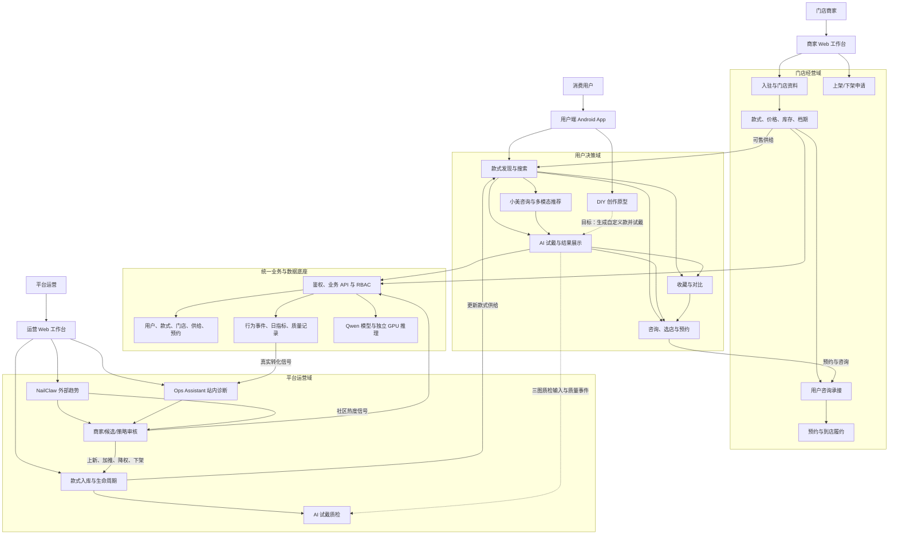

这张图从三个角色出发，体现了系统的核心关系：用户产生需求和行为，商家提供真实供给和履约，运营依据外部趋势与站内效果调整平台策略；三端不是三个孤立后台，而是共享同一款式、门店、预约与指标底座。

### 4.2 角色用例图（UML 语义）

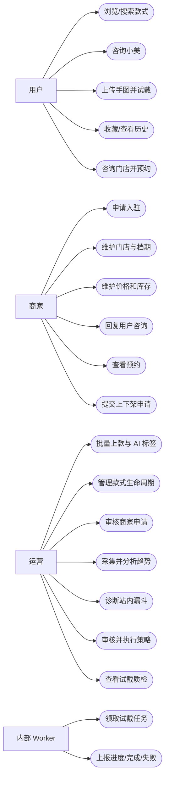

### 4.3 业务能力地图

| 一级能力 | 二级能力 | 用户端 | 商家端 | 运营端 |
|---|---|:---:|:---:|:---:|
| 账户与权限 | 注册登录、会话、角色、门店范围 | ✓ | ✓ | ✓ |
| 款式中心 | 款式主数据、图片、标签、搜索、收藏 | 消费 | 门店供给 | 全局管理 |
| AI 试戴 | 上传、任务、缓存、生成、历史、质检 | 发起/查看 | 间接受益 | 质量治理 |
| 智能助手 | 小美、NailClaw、Ops Assistant | 小美 | 策略承接 | 趋势与经营 Agent |
| 门店中心 | 入驻、资料、档期、在售款、库存 | 浏览 | 维护 | 审核 |
| 沟通履约 | 会话、预约、确认、记录 | 发起 | 承接 | 观察 |
| 运营分析 | 埋点、漏斗、日趋势、款式评分 | 产生信号 | 查看门店信号 | 全局诊断 |
| 生命周期 | 草稿、上架、加推、降权、下架 | 感知结果 | 提交申请 | 审核执行 |

### 4.4 用户端决策流程

用户主链路不是强迫每个用户都试戴，而是提供多条逐步增强信心的路径。

| 阶段 | 用户行为 | 系统响应 | 沉淀数据 | 异常/分支 |
|---|---|---|---|---|
| 发现 | 浏览首页、榜单、分类或搜索 | 返回在架且有图款式 | 曝光、来源页 | 无结果时推荐调整筛选 |
| 理解 | 查看详情或询问小美 | 展示标签、价格、适配理由 | 点击、咨询意图 | 意图不清时先澄清 |
| 验证 | 上传手图、发起 AI 试戴 | 创建任务并展示阶段进度 | 试戴开始 | 非手图、素材缺失、模型失败时明确提示 |
| 比较 | 查看结果、收藏、重新生成 | 保存结果和历史 | 完成、收藏、质量 | 可回到其他款式继续试戴 |
| 承接 | 查看候选门店 | 当前先返回具有任一在售 Listing 的门店，提交预约时再严格校验所选款式、库存和档期 | 门店点击、会话 | 无供给时提示换店/换款 |
| 转化 | 选择档期、填写信息并确认 | 校验库存和档期，创建预约 | 预约创建/确认 | 库存或档期变化时阻止提交 |

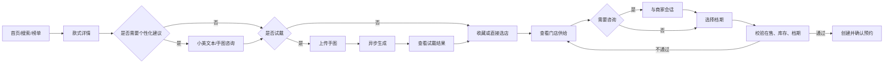

### 4.5 商家端经营流程

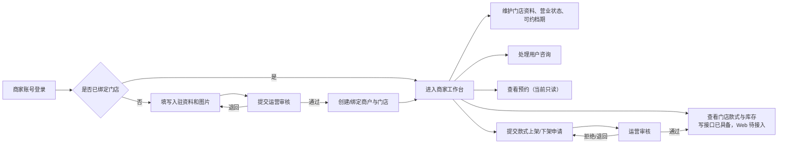

### 4.6 运营端工作流程

运营侧包含两条互补的智能链路，必须区分：

- **NailClaw**读取外部社区样本，回答“市场最近在流行什么”；
- **Ops Assistant**读取站内经营指标，回答“我们的款式表现如何、该调整什么”。

当前两者在工作台、款式库和指标层汇合，但不是由同一个 Agent 在一次推理中直接融合所有数据。

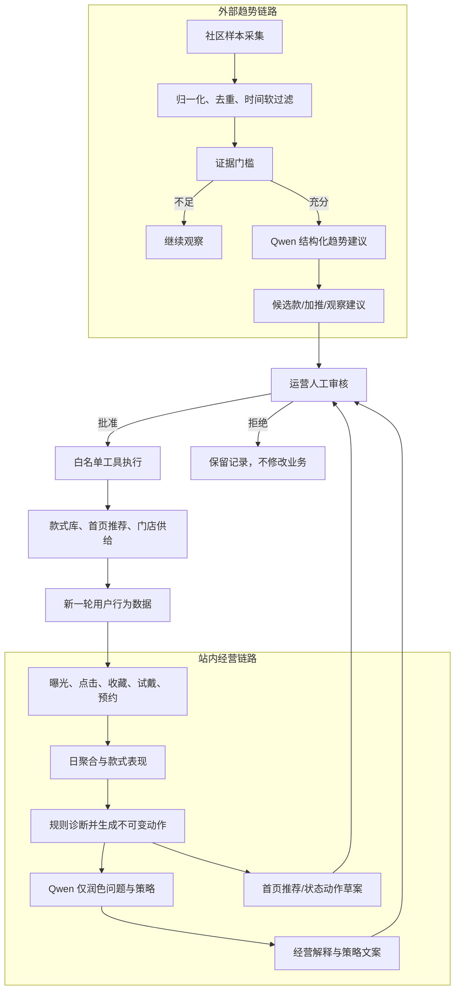

### 4.7 三端业务闭环

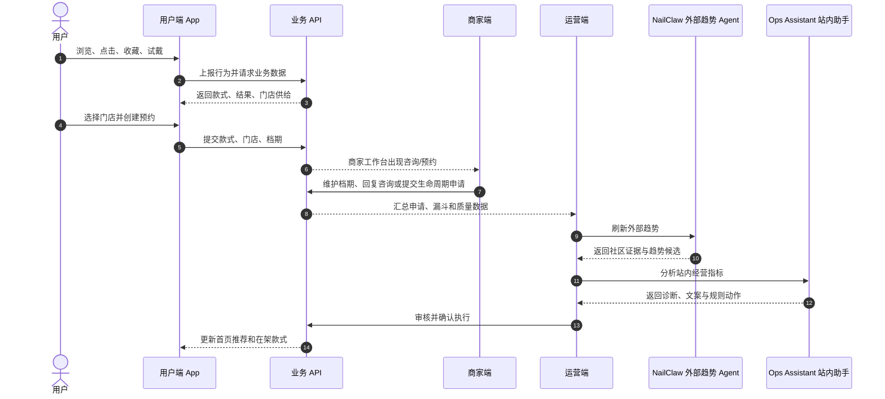

---

## 5. 系统架构设计

### 5.1 系统上下文

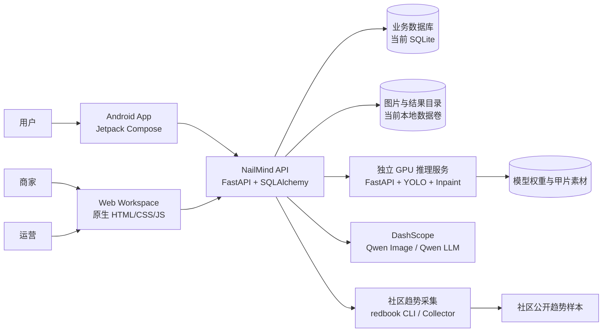

### 5.2 逻辑分层架构

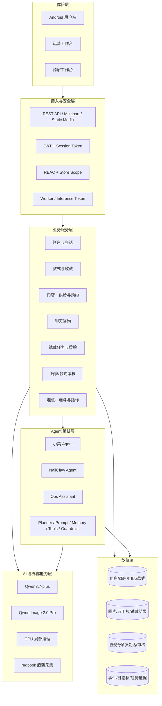

### 5.3 核心组件职责

| 组件 | 技术 | 主要职责 | 明确不负责 |
|---|---|---|---|
| Android App | Kotlin、Jetpack Compose、Retrofit/OkHttp | 用户交互、图片上传、任务轮询、结果展示、预约 | 不直连模型和数据库 |
| Web Workspace | 原生 HTML/CSS/JavaScript | 按角色渲染运营/商家页面，调用后台 API | 不直接采集社区、不直接写数据库 |
| 业务 API | FastAPI、Pydantic、SQLAlchemy | 鉴权、业务规则、任务编排、Agent、聚合、静态资源 | 不在进程内加载大体量 GPU 模型 |
| GPU 推理服务 | FastAPI、Pillow/OpenCV、YOLO、Diffusers | 指甲定位、几何配准、局部融合、返回图片 bytes | 不访问业务数据库，不判断用户权限 |
| Qwen 服务 | DashScope API | 图片生成、素材生成、多模态理解、Agent 推理、质量评估 | 不直接执行平台经营动作 |
| 趋势采集器 | redbook CLI + NailClawCollector | 搜索、归一化和输出可追溯社区样本 | 不生成经营结论、不直接写业务状态 |
| 数据库 | 当前 SQLAlchemy + SQLite | 业务真相、任务、指标、证据和审核记录 | 不存放大图片二进制 |
| 文件数据卷 | 当前本地目录 | 款式图、手图、甲片素材、结果图 | 不承担结构化查询 |

### 5.4 支持的比赛部署拓扑（GPU 为可选环境依赖）

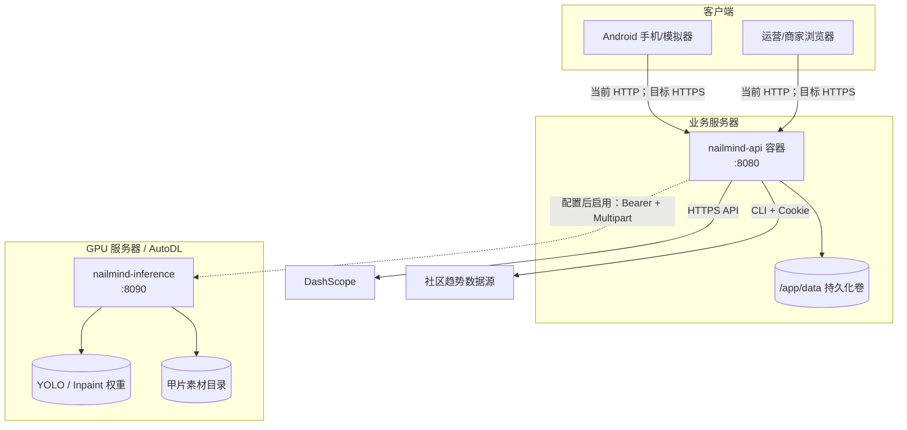

当前远程 Compose 只编排 API 容器并直出 `:8080` HTTP，未编排反向代理、TLS 或 inference。推理服务代码提供独立 `/health`，能够报告后端模式、模型目录、分割权重、生产模式和参考适配器状态，但是否启用取决于比赛部署配置。外网演示应增加 HTTPS 反向代理，并通过安全网络隐藏内部推理端口。

### 5.5 技术选型

| 层次 | 选型 | 选择理由 |
|---|---|---|
| Android | Kotlin + Jetpack Compose + Material 3 | 原生性能、声明式 UI、适合图片与状态流程 |
| 网络 | Retrofit + OkHttp | 类型化接口、Multipart 上传、Token 拦截和超时控制 |
| Web | 原生 HTML/CSS/JS | 黑客松迭代快、部署轻、无需复杂构建链 |
| API | Python + FastAPI | 多模态/AI 生态成熟、OpenAPI 友好、开发速度快 |
| ORM | SQLAlchemy | 模型清晰，当前 SQLite 与后续 MySQL 可迁移 |
| 图像处理 | OpenCV + Pillow | 分割后处理、几何变换、alpha 与图片编码 |
| 分割 | Ultralytics YOLO11s-seg | 速度快、支持实例分割、便于继续微调 |
| 局部生成 | Diffusers + SDXL Inpaint / Reference Adapter | 限定局部区域、可加载本地 GPU 权重 |
| 云模型 | Qwen Image 2.0 Pro + Qwen3.7-plus | 国内接入、多模态、统一 API 与密钥体系 |
| 部署 | Docker + 数据卷 | 环境一致、便于远程服务器快速恢复 |

### 5.6 架构边界与替换点

- App 固定调用业务 API，不随 Qwen、SDXL 或未来模型变化；
- 选择独立 GPU 路径时，业务 API 固定调用 `/v1/tryon/edit`，替换该路径内的图像模型只影响推理服务内部；默认 Qwen 路径直接调用 DashScope；
- `TRYON_INFERENCE_BASE_URL` 未配置时可走 Qwen Image 基线，配置后走独立推理；
- NailClaw 的采集与分析已经分层；当前只实现 redbook，新增来源需实现相同归一化契约的 Collector；
- Agent 的工具管理器只暴露有限业务动作，模型不持有数据库连接或任意代码执行权限；
- Web 工作台按角色配置不同导航和接口，避免仅靠前端隐藏实现权限控制。

### 5.7 生产化演进架构（演进设计）

当前 SQLite、本地文件和进程内后台任务足以支撑比赛演示，但不适合多实例和高并发。生产化建议保持 API 合约不变，逐步替换基础设施：

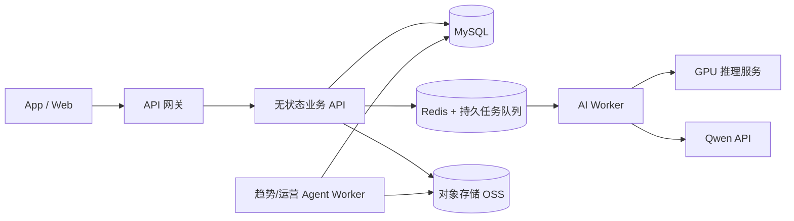

演进顺序建议为：先对象存储和数据库，再持久任务队列，最后拆分 Agent Worker 与横向扩容；每一步均保留原接口和回滚路径。

---


## 6. 核心领域与数据设计

### 6.1 领域划分

| 领域 | 核心对象 | 领域职责 |
|---|---|---|
| 身份与租户 | User、SessionToken、Merchant、Store | 用户身份、角色、商户归属和门店范围 |
| 款式与供给 | Style、NailStyleAsset、StoreStyleListing | 平台款式、试戴素材、门店价格库存和状态 |
| 试戴 | HandImage、TryOnJob、TryOnRecord | 输入图片、任务状态、缓存结果和生成记录；质量分另存评估事件 |
| 用户互动 | Favorite、ChatConversation、ChatMessage | 收藏、用户与门店咨询 |
| 预约 | Booking | 款式、门店、档期、联系人和预约状态 |
| 入库与审核 | StyleIngestionBatch/Item、StyleLifecycleRequest、MerchantOnboardingApplication | 批量上款、商家入驻和生命周期审批 |
| 数据运营 | EventLog、StyleMetricsDaily | 原始事件、日指标、漏斗和健康状态 |
| 趋势运营 | TrendTopic、TrendPost、TrendRecommendation | 社区主题、证据帖子和待审核建议 |

当前模型中一部分关系使用数据库外键，一部分使用 `style_code`、`store_code`、`conversation_code` 等业务编码作逻辑关联。比赛版便于快速迭代，生产化时应逐步补齐外键、唯一约束、软删除和审计版本。

### 6.2 核心业务类图

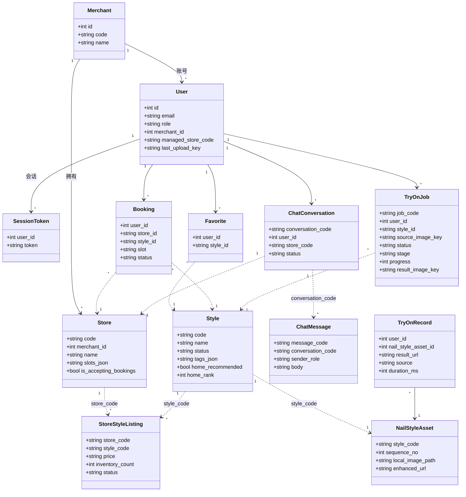

### 6.3 运营分析类图

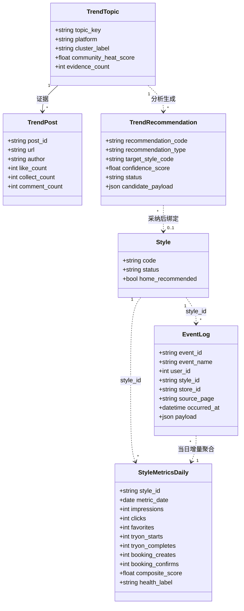

### 6.4 主要数据表说明

| 表 | 主标识 | 关键字段 | 主要读写方 |
|---|---|---|---|
| `users` | `id/email` | role、merchant_id、managed_store_code、preferences | 三端认证、权限、小美 |
| `session_tokens` | token | user_id、created_at | 鉴权与注销 |
| `merchants` | code | name | 商家/运营 |
| `stores` | code | merchant_id、slots、is_accepting_bookings | 用户选店、商家资料 |
| `styles` | code | 标签、状态、首页推荐位 | 用户浏览、运营管理 |
| `nail_style_assets` | style_code | 原图、增强图、本地图、序号 | 试戴、入库、质检 |
| `store_style_listings` | store+style | price、inventory、status | 商家供给、预约校验 |
| `style_ingestion_batches/items` | batch/item code | 阶段、进度、子任务、租约、错误 | 批量上款 |
| `favorites` | user+style | created_at | 用户收藏 |
| `hand_images` | hand_code | URL、本地路径、来源 | 同步试戴兼容链路 |
| `try_on_jobs` | job_code | 输入键、状态、阶段、结果键、错误 | Android 异步试戴 |
| `try_on_records` | id | 结果 URL、来源、耗时 | 历史、质量、统计 |
| `bookings` | id | user/store/style/slot/status | 用户预约、商家查看 |
| `chat_conversations/messages` | conversation/message code | 门店、发送方、正文、时间 | 用户与商家咨询 |
| `style_lifecycle_requests` | request_code | 动作、原因、状态、审核人 | 商家申请、运营审批 |
| `merchant_onboarding_applications` | application_code | 门店资料、图片、状态、审核意见 | 商家入驻 |
| `event_logs` | event_id | 事件、用户、款式、门店、来源、payload | 漏斗与审计 |
| `style_metrics_daily` | style+date | 七步漏斗与评分 | 看板、Ops Assistant |
| `trend_topics/posts/recommendations` | 各业务编码 | 主题、证据、建议、置信度、审核 | NailClaw、运营 |

### 6.5 事件模型与转化漏斗

当前核心业务事件为：

```text
style_impression
  → style_click
  → style_favorite
  → tryon_start
  → tryon_complete
  → booking_create
  → booking_confirm
```

| 指标 | 计算口径 |
|---|---|
| 点击率 CTR | `clicks / impressions` |
| 收藏率 | `favorites / clicks` |
| 试戴启动率 | `tryon_starts / clicks` |
| 试戴完成率 | `tryon_completes / tryon_starts` |
| 预约转化率 | `booking_creates / clicks` |
| 确认转化率 | `booking_confirms / clicks` |

当前事件写入时同步增量更新当日指标，适合比赛版即时看板。生产化应改为原始事件只追加、聚合异步消费，并以每日重算纠正重复或乱序数据。

### 6.6 热度与经营评分

#### 6.6.1 当前款式综合评分

```text
CTR           = 点击 / 曝光
收藏率        = 收藏 / 点击
试戴率        = 试戴开始 / 点击
预约率        = 预约创建 / 点击

社区热度分    = 与款式绑定的趋势建议最高置信度 × 100
站内兴趣分    = (CTR×40 + 收藏率×20 + 试戴率×20 + 预约率×20) × 100
综合推荐分    = 社区热度分×0.55 + 站内兴趣分×0.45
```

社区建议在被匹配或采纳为具体款式前可能没有 `target_style_code`，因此当前“社区 + 站内”的融合主要体现在数据模型和看板评分层，尚不是一次统一 Agent 推理。

此外，当前实现对加权后的站内兴趣值再次乘以 100，理论值可能超过常见的 0～100 区间。比赛展示应说明这是现行内部排序分而非百分制；生产化应先将各转化率截断到 `[0,1]`，再统一归一化和校准，避免将内部排序分误读为概率。

#### 6.6.2 当前健康标签

| 条件 | 标签 | 业务解释 |
|---|---|---|
| 曝光 < 20 且点击 < 3 | `insufficient_distribution` | 分发不足，不能过早判断 |
| 曝光 ≥ 20 且 CTR < 8% | `delist_candidate` | 曝光有效但吸引力不足 |
| 点击 ≥ 8 且预约 = 0 | `optimize_candidate` | 有兴趣但承接或转化存在问题 |
| 其他 | `healthy` | 当前表现稳定 |

#### 6.6.3 Ops Assistant 行为分

```text
行为分 = 点击×4 + 收藏×6 + 试戴开始×8 + 试戴完成×5 + 预约×30
```

- 潜力款：行为分大于 0，且试戴 ≥ 2、收藏 ≥ 1 或 CTR ≥ 4%；
- 弱款：曝光 ≥ 80 且 CTR < 1.5%，或曝光 ≥ 150、点击 ≤ 2、试戴开始 ≤ 2 且预约 = 0；
- 高曝光无转化：曝光 ≥ 180、点击 ≤ 1、试戴 = 0、预约 = 0。

这些阈值由代码控制，大模型只能优化解释，不能增加或改变动作。

#### 6.6.4 NailClaw 证据门槛

```text
互动分 = 点赞 + 2×收藏 + 3×评论
```

进入可分析趋势建议必须同时满足：至少 2 条去重样本、至少 1 张可复核图片、最高点赞不低于 100、总互动分不低于 500。满足门槛后仍可能被分类为 `watch_trend`；证据不足时输出 `insufficient_evidence`，业务上只允许继续观察。

### 6.7 核心状态机

#### 6.7.1 试戴任务（状态与阶段）

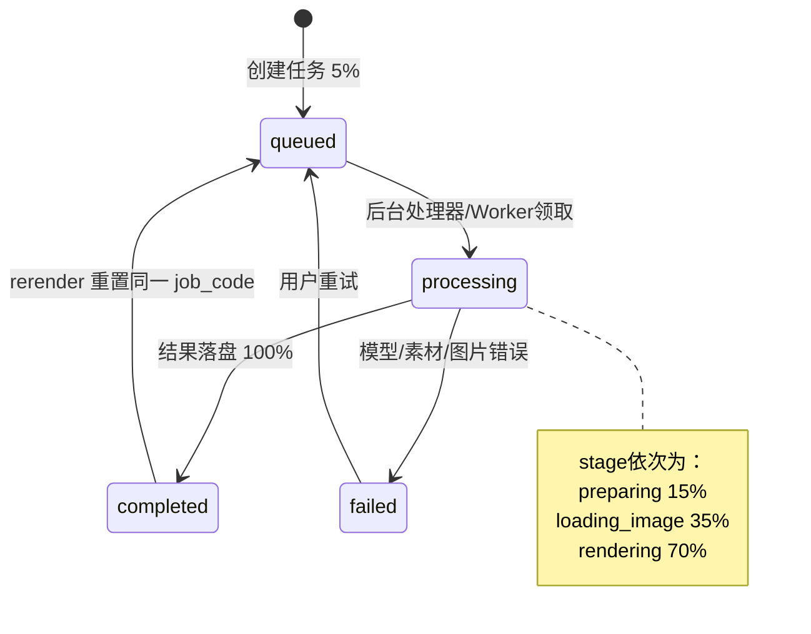

#### 6.7.2 批量款式入库

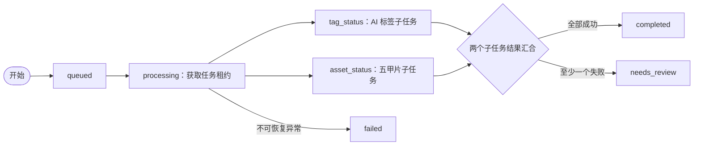

`tag_status` 与 `asset_status` 是同一入库 Item 下并行推进的子状态，`finalizing` 并不是数据库持久状态；当前也没有从 `needs_review` 一键重试的公开 API/UI。

#### 6.7.3 商家与款式审批

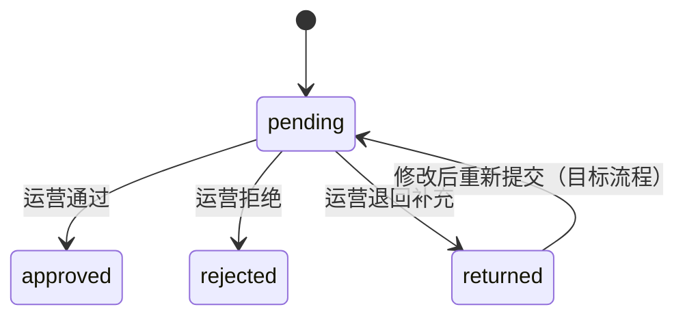

当前后端对“已有 pending 入驻申请”的再次提交会拒绝，Web 的“编辑后重提”交互与后端尚需统一。

#### 6.7.4 预约

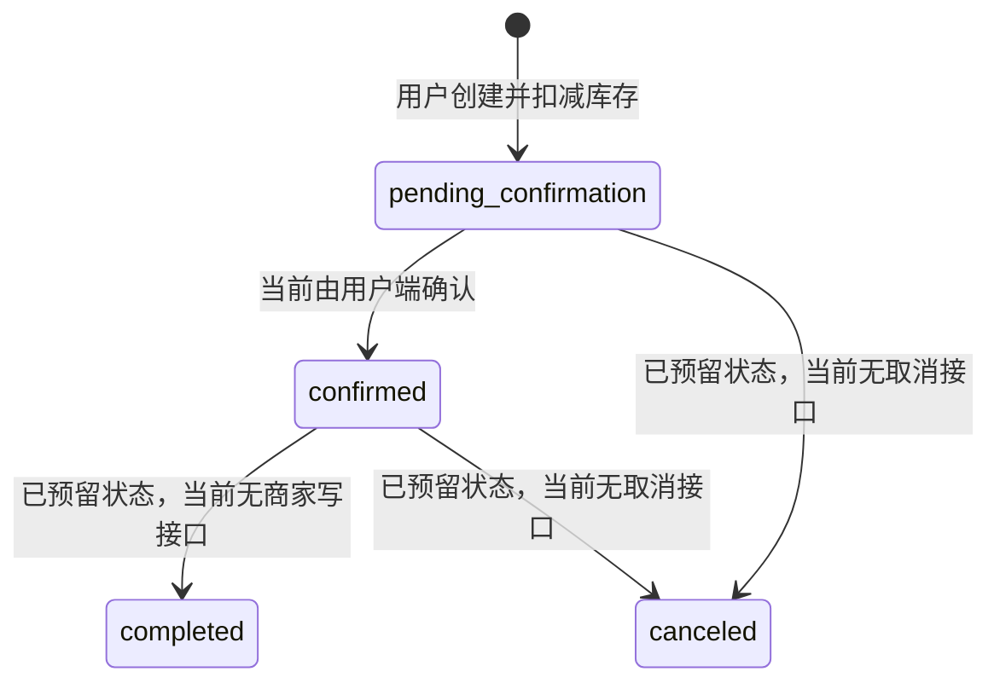

比赛版已完成“创建—用户确认—商家查看”；商家确认、完成、取消、爽约、库存回补属于生产化待完善能力，不能作为当前已交付能力宣称。

### 6.8 数据分级与保留原则

| 级别 | 数据示例 | 当前用途 | 目标控制 |
|---|---|---|---|
| 高敏感 | 用户手图、试戴结果、手机号 | 生成、预约、结果查看 | 私有对象、短期签名 URL、到期删除、用户主动删除 |
| 敏感 | 会话正文、预约备注、商家联系人 | 咨询与履约 | 角色/门店隔离、审计、最小展示 |
| 内部 | 原始事件、模型评估、Agent 建议 | 分析与优化 | 去标识化、访问控制、留存周期 |
| 可公开 | 在架款式图、门店公开资料 | 用户浏览 | CDN/缓存、版本管理 |

---

## 7. 关键功能设计

### 7.1 AI 试戴设计

#### 7.1.1 设计目标与不变量

AI 试戴必须同时满足两类目标：款式要像，手还要是用户原来的手。系统将以下内容视为不变量：

- 手指数量、手掌和手指结构；
- 指甲所在位置与朝向；
- 用户肤色、皮肤纹理和原图光照；
- 背景、构图、画幅和非甲面区域；
- 不增加文字、水印、边框或无关饰品。

允许变化的主要区域只有可见甲面，包括颜色、纹理、图案、猫眼、渐变、法式边和合理装饰。

#### 7.1.2 当前 Android 主链路时序

当前 Android 实际使用异步任务接口；同步接口保留作兼容、测试与其他客户端接入。

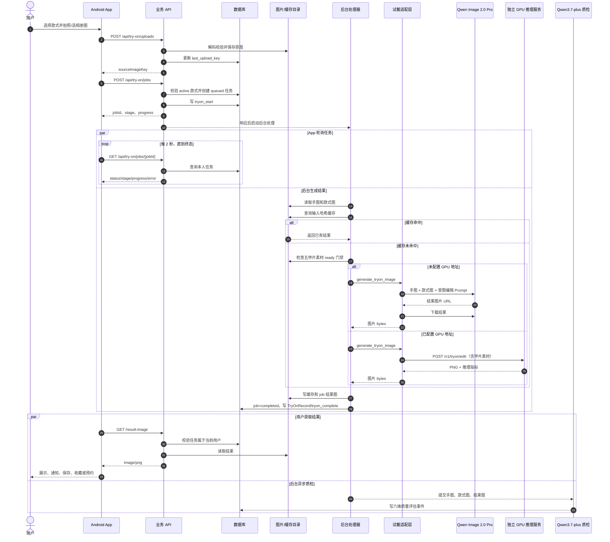

App 会把待处理任务和款式 ID 保存到 `SharedPreferences`，在进程恢复后继续轮询；用户离开处理页时，任务完成可触发本地通知。当前拍照入口使用相机预览 Bitmap，相册入口可获得原图，后续应改为全分辨率相机文件 URI。

#### 7.1.3 输入、缓存与输出

**输入**：用户手图、款式 ID、源图片键、默认甲长/甲型。当前 Android 固定提交 `natural_short/squoval`，甲长和甲型进入记录及缓存键，但尚未真正传入 Qwen Prompt 或独立推理请求影响效果。

**缓存键**：

```text
hand_{手图SHA256前16位}
+ style_{款式素材序号}
+ selectedLength
+ selectedShape
```

缓存减少重复费用和等待时间。生产化时应把款式图片内容哈希、模型名、模型版本、Prompt 版本和重生成 nonce 一并加入，避免换图后误命中旧结果。

**输出**：`TryOnJob` 记录状态和结果键；`TryOnRecord` 记录结果 URL、模型来源、耗时和用户/款式关系；事件表记录开始、完成与质量评估。

#### 7.1.4 统一模型适配

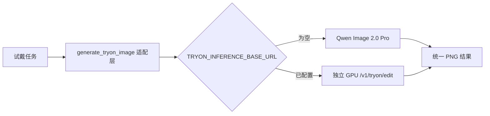

当前已配置独立 GPU 服务时，其失败不会自动回退到 Qwen，以避免在未知质量和成本下静默切换。更合适的生产策略是由显式熔断与运营开关控制，而不是请求级隐式回退。

#### 7.1.5 独立 GPU 局部推理管线

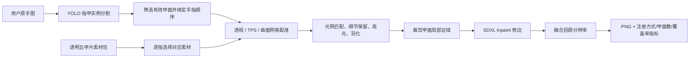

生产模式要求至少检测到配置数量的有效甲面，禁止启用启发式假 Mask，禁止使用 `mock/mask_only`，款式素材缺失时直接失败。Reference Adapter 模式若未配置权重也会显式报错，不静默输出低质量结果。

#### 7.1.6 六维质量评估

试戴完成后，质量模型同时读取原手图、目标款式图和生成结果图，逐项评分：

| 维度 | 判断内容 | 通过阈值 |
|---|---|---:|
| 款式还原度 | 颜色、图案、纹理、质感 | 80 |
| 甲面贴合 | 位置、边缘、透视、是否覆盖皮肤 | 80 |
| 手指数量 | 多指、少指、合并、畸形 | 80 |
| 皮肤质感 | 肤色、纹理、光照是否保持 | 80 |
| 手型姿态 | 姿势、比例、结构是否保持 | 80 |
| 背景保持 | 背景和非甲面区域是否变化 | 80 |

六项全部达标才允许 `passed=true`。综合手部一致性不是简单平均，而是对最弱子项赋予更高权重：

```text
manualConsistency = 平均值×0.35 + 最弱项×0.65
```

质检失败目前写入运营质量中心和日志，不阻塞已经交付给用户的结果。后续可按业务策略将严重结构错误改为“先质检后交付”或自动重试。

#### 7.1.7 失败与用户反馈

| 失败场景 | 系统处理 | 用户可见信息 |
|---|---|---|
| 非支持格式/无法解码 | 上传阶段拒绝 | 请上传 JPG/PNG 有效图片 |
| 款式不存在或未上架 | 不创建任务 | 款式已不可用，请重新选择 |
| 源图不存在 | 不创建/任务失败 | 手图已失效，请重新上传 |
| 五甲片素材未就绪 | 拒绝在线试戴 | 款式正在准备试戴素材 |
| 无有效手部/甲面不足（独立 GPU 路径） | 分割门禁使推理失败 | 请重新拍摄完整清晰手部 |
| 模型限流 | 写失败原因 | 请求较多，请稍后再试 |
| 模型超时/5xx | 写任务错误与日志 | 服务暂时异常，可稍后重试 |
| Qwen 欠费/密钥错误 | 错误归一化 | 提示管理员检查 AI 服务配置 |

### 7.2 款式批量入库与素材预处理

#### 7.2.1 业务价值

对独立 GPU 路径而言，如果在用户发起试戴时才临时分析完整款式图，耗时更长且结果不稳定。NailMind 将标签、透明甲片和人工复核前置到款式入库，再允许上架和试戴。默认 Qwen 基线路径仍在每次试戴中发送完整手图与完整款式图；五甲片在该路径当前主要承担素材 ready 门禁，并未传入 Bailian 生成函数。

#### 7.2.2 时序图

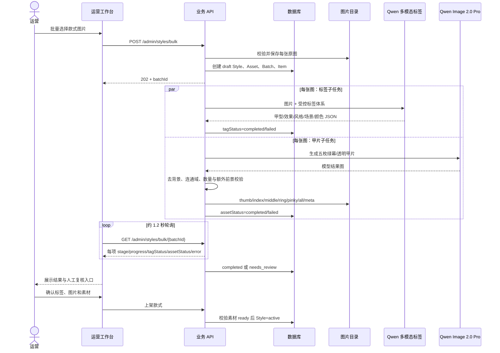

#### 7.2.3 可靠性设计

- 单次最多图片数、单图字节数和像素数均可配置；当前默认最多 20 张、12 MB、2400 万像素；
- 批次与单项任务持久化，API 重启会扫描未完成或租约过期任务；
- 每张图的标签和甲片生成并行，默认批量 Worker 并发 2；
- 两个子任务分别记录状态和错误，单项失败不阻塞整批；
- AI 失败的款式保持草稿或 `needs_review`，不自动上架；
- 上架前再次检查甲片素材 `ready`，把质量门禁放在最终业务动作处。

### 7.3 NailClaw 外部趋势 Agent

#### 7.3.1 定位与 OpenClaw 关系

NailClaw 是项目自研的工具型 Agent，采用与 OpenClaw 类似的 Role/Prompt、Planner、Tools、Memory、Guardrail 组织方式；当前并未把 OpenClaw Runtime 直接嵌入业务服务。比赛版只把 `redbook` 当作普通 CLI 调用；未来可以评估将相同采集能力封装为 OpenClaw 工具，但这不属于当前已验证实现。

#### 7.3.2 Agent 架构

```mermaid
flowchart TB
    O["运营触发/可配置日更"] --> C["NailClawCollector"]
    C --> R["redbook CLI + Cookie"]
    R --> N["归一化、去重、真实性校验\n可解析时间按窗口过滤"]
    N --> T[("TrendTopic / TrendPost")]
    T --> G["证据门槛与置信度"]
    G -- "不足" --> SKIP["insufficient_evidence / 继续观察"]
    G -- "充分" --> P["NailClawPlanner"]
    P --> L["Qwen3.7-plus 结构化 JSON"]
    L -. "无密钥、超时、非法JSON" .-> F["确定性降级建议"]
    L --> TM["ToolManager"]
    F --> TM
    TM --> STAGE["stage_style_candidate"]
    STAGE --> REC[("pending TrendRecommendation")]
    REC --> H["运营人工审核"]
    H -- "通过" --> LIB["当前：尝试直接写 active\n目标：draft→素材生成→复核→active"]
    H -- "拒绝" --> END["保留证据和审核记录"]
```

当前 `NailClawMemory` 是预留接口，持久状态由趋势表承载，但历史采纳结果尚不会自动成为下一轮经验。长期业务记忆应记录“建议—审核—执行—7/14 日效果”，而不是简单保存对话。

当前趋势采集对能解析发布时间的帖子执行近 7 天过滤；缺失或无法解析发布时间的样本可能被保留，因此这是“软时间窗口”。建议在证据卡中显示时间完整性，并对未知时间样本降权，而不是把它们等同于近 7 天新帖。

当前 `launch_candidate` 审批会尝试直接创建 `active` 款式并立即要求五甲片素材 ready，社区候选通常因此被门禁阻止。正确的下一步是先创建 draft、进入统一入库任务，素材与人工复核完成后再 active。

#### 7.3.3 趋势发现时序

```mermaid
sequenceDiagram
    actor O as 平台运营
    participant W as 运营工作台
    participant API as 趋势 API
    participant CLI as redbook CLI
    participant DB as 趋势数据库
    participant NC as NailClaw
    participant LLM as Qwen3.7-plus
    participant TOOL as 候选款工具

    O->>W: 点击读取近 7 天数据
    W->>API: POST /admin/trends/crawl 或 collect
    API->>CLI: 按关键词热门排序搜索图文
    CLI-->>API: 帖子、作者、图片、赞藏评、时间
    API->>API: 归一化、去重、真实性校验；可解析时间按窗口过滤
    API->>DB: Upsert Topic/Post
    API-->>W: topicIds + 来源样本

    W->>API: POST /admin/trends/analyze(topicIds)
    API->>DB: 读取有效证据
    API->>NC: 主题、热度、帖子证据
    alt 证据不足
        NC-->>API: 继续观察，不应进入可执行候选
    else 证据充分
        NC->>LLM: 结构化规划 Prompt
        alt LLM 正常
            LLM-->>NC: 建议 + tool_calls
        else LLM 异常
            NC->>NC: 确定性规则降级
        end
        NC->>TOOL: stage_style_candidate
        TOOL-->>NC: 带来源帖的候选 payload
        API->>DB: 保存 pending 建议
    end
    API-->>W: 建议、理由、置信度、证据
    O->>W: 通过或驳回
    alt 运营驳回
        W->>API: POST reject
        API->>DB: status=rejected，记录审核人、时间和备注
    else 运营尝试采纳
        W->>API: POST approve
        API->>API: 校验类型、目标款式和五甲片素材
        alt 当前前置条件满足
            API->>DB: 执行业务变更并写 status=approved
        else 自动候选未绑定/素材未就绪/类型不支持
            API-->>W: 返回错误，建议保持 pending
        end
    end
```

#### 7.3.4 趋势动作类型

| 类型 | 含义 | 当前可执行性 | 目标业务动作 |
|---|---|---|---|
| `launch_candidate` | 社区出现强新品方向 | 自动建议通常无 `target_style_code`；当前审批直接建 active，常被素材门禁阻止 | 先建 draft，进入素材处理和复核 |
| `boost_candidate` | 现有类似款具备加推价值 | 必须先绑定真实目标款式；绑定后当前只确保/恢复 `active`，并不会设置首页推荐位 | 绑定款式后再执行真实加推策略 |
| `watch_trend` | 有信号但尚不充分 | `apply_recommendation` 当前不支持执行 | 保持观察，不写高影响动作 |
| `deprioritize_candidate` | 热度或匹配度下降 | 必须绑定目标款式，否则不可执行 | 降权或转草稿，需人工确认 |
| `insufficient_evidence` | 证据门槛未满足 | 已在落库前跳过 | 只展示日志/原因，不进入审批动作 |

规则基线按最高点赞和图片数分类：最高点赞 ≥ 5000 且图片 ≥ 2 时为 `launch_candidate`，最高点赞 ≥ 1000 时为 `boost_candidate`，其余为 `watch_trend`。Qwen 可在允许枚举内提出不同类型，但置信度会被证据分限定；当前自动建议的 `target_style_code` 均为空，只有完成候选—真实款式匹配后，`boost/deprioritize` 才具备执行前提。

### 7.4 Ops Assistant 站内运营助手

Ops Assistant 与 NailClaw 的区别是输入来自站内真实经营数据。它先由规则层计算，再让 Qwen 对摘要、问题和策略进行自然语言增强，最终动作仍使用原始规则结果。

```mermaid
sequenceDiagram
    actor U as App 用户
    participant API as 业务 API
    participant M as EventLog/日指标
    actor O as 运营
    participant W as 运营助手
    participant R as 规则 Planner
    participant L as Qwen3.7-plus
    participant T as 白名单工具
    participant S as 款式库

    U->>API: 浏览、收藏、试戴、预约
    API->>M: 写事件并更新日指标
    O->>W: 分析近 7 天
    W->>API: POST /admin/ops-assistant/analyze
    API->>M: 聚合款式表现
    M-->>R: 曝光/点击/收藏/试戴/预约
    R->>R: 识别潜力款、弱款和断点
    R->>R: 生成不可变动作候选
    R->>L: 指标 + 规则诊断 + 动作摘要
    L-->>R: 仅润色摘要/问题/策略
    R-->>W: 指标、策略、待确认动作
    O->>W: 确认执行
    W->>API: POST /admin/ops-assistant/execute
    API->>T: set_home_recommendation / set_style_status
    T->>T: 二次校验类型、状态、展示图
    T->>S: 更新 status/home_rank
    API-->>W: 分项执行结果
```

白名单动作只有两类：

- `set_home_recommendation`：设置/取消 App 首页推荐并指定排序；
- `set_style_status`：将款式改为 `active/inactive/draft`。

演示数据会被标记 `previewOnly`，工具层拒绝写入真实款式。分析和执行均写事件，便于后续审计。

### 7.5 小美用户助手

#### 7.5.1 设计链路

```mermaid
flowchart LR
    IN["用户文本/手图"] --> MEM["请求级用户偏好与最近手图"]
    MEM --> INT["意图识别与澄清"]
    INT --> RAG["美甲知识库检索"]
    INT --> V["Qwen 多模态手图分析"]
    RAG --> PLAN["推荐 Planner"]
    V --> PLAN
    PLAN --> CAT["只读在架款式 Catalog Tool"]
    CAT --> OUT["回复 + 推荐卡片 + App 路由入口"]
```

小美知识库覆盖款式、颜色、甲型、材质、工艺、人群、场景、趋势、护理、FAQ 和推荐规则。关键安全规则包括：闲聊不调用推荐工具、意图不清先澄清、非手图提示重传、不编造款式 ID、Catalog 只返回已上架且有图的真实款式。

当前澄清、闲聊、知识检索、视觉工具、款式工具、推荐返回、流式输出与 App 卡片界面均已实现。现有全量后端测试已覆盖流式接口，下一步仍应补充真实模型和真实手图的推荐黄金集，验证款式相关性与多轮上下文稳定性。

### 7.6 用户咨询与预约

#### 7.6.1 当前预约时序

```mermaid
sequenceDiagram
    actor U as 用户
    participant A as Android App
    participant API as 业务 API
    participant DB as 数据库
    participant MW as 商家工作台

    alt 从独立“预约”Tab 进入
        U->>A: 浏览并选择门店
        A->>API: GET /api/stores
        API-->>A: 候选门店列表
        opt 用户在门店详情先咨询
            A->>API: 创建门店会话并发送消息
            API->>DB: 写 Conversation/Message
            MW->>API: 查询本店会话并回复
            API->>DB: 写商家消息
            API-->>A: 用户读取回复
        end
    else 从款式详情/试戴结果快捷预约
        U->>A: 点击预约同款
        A->>A: 直接进入表单，仍可从全部 storeOptions 选店
        Note right of A: 快捷入口不先经过门店详情/咨询
    end
    A->>A: 使用启动时 /api/stores 已返回的 slots
    U->>A: 填写联系人并提交
    A->>API: POST /api/bookings
    API->>DB: 校验款式 active、Listing active、库存 > 0、档期存在
    API->>DB: 创建 pending_confirmation 并扣库存 1
    API-->>A: 预约待确认
    U->>A: 确认预约
    A->>API: POST /api/bookings/{id}/confirm
    API->>DB: status=confirmed + booking_confirm 事件
    MW->>API: GET /admin/merchants/me/bookings
    API-->>MW: 返回本门店预约（当前只读）
```

当前 `/api/stores` 只保证门店存在任一在售 Listing，并不按用户当前选中款式过滤；最终提交时才严格校验。下一版应给接口增加 `styleId`，只展示真正能承接该款的门店。

从款式详情或试戴结果进入的 Android 快捷预约会直接打开表单，表单仍允许从全部 `storeOptions` 选店，但不会先进入门店详情或咨询。当前表单使用启动阶段 `/api/stores` 返回的 `Store.slots`，没有再次调用 `/api/stores/{id}/slots`；提交前服务端仍会重新校验时段。

商家可以在资料接口中切换 `is_accepting_bookings`，但当前预约创建尚未检查该字段；比赛版演示需保持接单开启，正式修复应把它与款式、Listing、库存、档期一起放入同一事务校验。

#### 7.6.2 目标履约状态（演进设计）

```text
用户提交 pending_merchant
  → 商家接受 confirmed
  → 用户到店 checked_in
  → 服务完成 completed
  → 评价 reviewed

任意未履约阶段可按规则进入 canceled / no_show，
取消时通过库存流水执行幂等回补。
```

### 7.7 商家入驻与款式生命周期协同

#### 7.7.1 入驻流程

```mermaid
sequenceDiagram
    actor M as 商家
    participant MW as 商家工作台
    participant API as 业务 API
    participant DB as 数据库
    actor O as 运营
    participant OW as 运营工作台

    M->>MW: 填写门店、联系人、营业时间、档期、图片
    MW->>API: POST /admin/merchants/me/store-application
    API->>DB: 创建 pending 申请
    API-->>MW: 返回申请编号
    O->>OW: 查看商家审核
    OW->>API: GET /admin/requests
    API-->>OW: 入驻与款式申请统一列表
    alt 资料不完整
        O->>OW: 退回/拒绝并填写原因
        OW->>API: return/reject
        API->>DB: 记录审核人、时间、意见
    else 审核通过
        O->>OW: 通过
        OW->>API: approve
        API->>DB: 创建 Merchant/Store 并绑定 managed_store_code
        API->>DB: application=approved
        API-->>MW: 商家可进入门店工作台
    end
```

商家账号当前需要演示环境预置为商家角色，公开注册只创建 `customer`。正式产品应增加受控邀请或运营创建商家账号流程。

#### 7.7.2 已有款式上下架申请

```mermaid
sequenceDiagram
    actor M as 商家
    participant MW as 商家工作台
    participant API as 业务 API
    participant DB as 数据库
    actor O as 运营
    participant OW as 运营工作台
    participant APP as 用户 App

    M->>MW: 选择本店已有 Listing 并申请上架/下架
    MW->>API: POST /admin/merchants/me/requests
    API->>API: 校验角色、门店归属和款式
    API->>DB: 保存 pending 申请
    O->>OW: 查看申请与原因
    OW->>API: POST /admin/requests/{id}/approve
    alt requestedAction=launch
        API->>DB: 校验五甲片素材 ready
        alt 素材就绪
            API->>DB: Style=active，Listing=active，写 published_at
            API->>DB: request=approved
            APP->>API: 拉取款式/门店
            API-->>APP: 返回最新供给
        else 素材未就绪
            API-->>OW: 400，申请保持 pending
        end
    else requestedAction=delist
        API->>DB: 仅将本店 Listing=inactive
        API->>DB: 不检查五甲片，不修改全局 Style
        API->>DB: request=approved
        API-->>OW: 审核成功
    end
```

当前商家 Web 主要展示库存、状态并提交已有 Listing 的生命周期申请；后端虽提供 Listing 价格/库存 PATCH，前端尚未接入。商家上传全新款式图片也尚未实现，新图片入库由运营端负责。目标流程应为“商家上传新款 → AI 标签与素材 → 运营审核 → 创建 Listing”。

门店编辑页面当前能填写名称、城市、价格带、营业时间、美甲师数等字段，但后端更新 Schema 只接收档期和接单状态；这些展示字段在当前版本不会全部持久化。下一版应统一前后端契约并以读取回显测试验证保存结果。

### 7.8 运营看板与质量闭环

运营总览按近 7 天返回：总漏斗、转化率、日趋势、各款式快照和聚合试戴质量，只返回均值、样本量和状态。独立质检中心为了模型/人工复核会展示原手图、款式图和结果图，并返回用户 ID；该明细仅限 `platform_admin`，还应补访问审计和更细的质检员权限。

商家看板中的曝光、点击和试戴目前按“本店拥有的款式 ID”映射平台需求信号，并非严格按 `EventLog.store_id` 归因。同一款式被多店销售时可能在多个门店看板中出现。文档和界面应称其为“平台款式需求映射”，后续再补入口、渠道和门店归因字段。

平均耗时采用样本均值，并在样本数大于 1 时计算 99% 置信区间：

```text
均值置信区间半宽 = 2.576 × 样本标准差 / √样本量
```

还原度和手部一致性来自人工或模型评估事件。没有样本时必须返回 `pending_evaluation / 待评测`，不展示虚构分数。

---

## 8. 接口与权限设计

### 8.1 接口风格

- 用户业务统一前缀：`/api`；
- 运营/商家统一前缀：`/admin`，依赖角色决定页面与接口范围；
- 内部 Worker 前缀：`/internal`；
- GPU 服务独立前缀：`/v1`；
- JSON 使用业务 ID（如 `style-xxx`、`job-xxx`），图片上传使用 Multipart；
- 长任务创建后返回任务 ID，客户端轮询状态；
- 错误使用 HTTP 状态码和可读 `detail/errorCode/errorMessage`。

### 8.2 用户端主要接口

| 模块 | 方法与路径 | 用途 |
|---|---|---|
| 认证 | `POST /api/auth/register` | 注册用户 |
| 认证 | `POST /api/auth/login`、`logout`、`GET me` | 登录、注销、当前用户 |
| 首页 | `GET /api/home` | 首页推荐、标签和热词 |
| 款式 | `GET /api/styles`、`search`、`/{id}` | 列表、搜索、详情 |
| 收藏 | `GET/POST/DELETE /api/favorites...` | 收藏列表与切换 |
| 小美 | `POST /api/assistant/meimei/chat`、`chat/stream` | 文本/手图咨询与 SSE 流式响应 |
| 异步试戴 | `POST /api/try-on/uploads` | 上传当前 Android 手图 |
| 异步试戴 | `POST/GET /api/try-on/jobs...` | 创建、列表、轮询、结果、重生成 |
| 同步兼容 | `/api/tryon/upload-hand`、`try-on`、`history` | 同步试戴与统一历史 |
| 门店 | `GET /api/stores`、`/{id}`、`/{id}/slots` | 选店与档期 |
| 会话 | `POST /api/chats`、`GET/POST messages` | 用户与商家咨询 |
| 预约 | `GET/POST /api/bookings`、`confirm` | 创建、列表、确认 |
| 个人中心 | `GET /api/profile`、`settings` | 统计与设置 |
| 埋点 | `POST /api/events` | 客户端行为事件 |

### 8.3 运营端主要接口

| 模块 | 方法与路径 | 权限 |
|---|---|---|
| 认证 | `/admin/auth/login/me/logout` | 后台角色 |
| 款式 | `GET/POST/PATCH/DELETE /admin/styles...` | 仅平台运营 |
| 批量入库 | `POST /admin/styles/bulk`、`GET /bulk/{batchId}` | 仅平台运营 |
| AI 标签/素材 | `/auto-tag`、`/precompute-nail-assets` | 仅平台运营 |
| 商家审核 | `GET /admin/requests`、`approve/reject/return` | 仅平台运营 |
| 分析 | `/admin/analytics/overview/events/styles/{id}` | 仅平台运营 |
| 质检 | `/admin/tryon/quality...` | 仅平台运营 |
| 趋势 | `/admin/trends/dashboard/crawl/collect/analyze`、`demo` | 仅平台运营；demo 明确隔离 |
| 趋势审核 | `/admin/trends/recommendations/{id}/approve/reject` | 仅平台运营 |
| 运营助手 | `/admin/ops-assistant/analyze`、`analyze/stream`、`execute` | 仅平台运营 |

### 8.4 商家端主要接口

| 模块 | 方法与路径 | 数据范围 |
|---|---|---|
| 看板 | `GET /admin/merchants/me/dashboard` | 绑定门店 |
| 店铺 | `PATCH /admin/merchants/me/store` | 绑定门店 |
| 入驻 | `GET/POST /admin/merchants/me/store-application` | 当前商家账号 |
| 款式 | `GET /admin/merchants/me/listings` | 绑定门店 |
| Listing | `PATCH /admin/merchants/me/listings/{id}` | 后端已实现，Web 尚未接入 |
| 生命周期 | `GET/POST /admin/merchants/me/requests` | 绑定门店 |
| 预约 | `GET /admin/merchants/me/bookings` | 绑定门店，当前只读 |
| 咨询 | `GET chats/messages`、`POST messages` | 绑定门店 |

### 8.5 内部与推理接口

| 接口 | 鉴权 | 说明 |
|---|---|---|
| `POST /internal/try-on/jobs/claim` | Worker Token | 领取最早 queued 任务 |
| `POST /internal/try-on/jobs/{id}/progress` | Worker Token | 上报阶段和进度 |
| `POST /internal/try-on/jobs/{id}/complete` | Worker Token | 写结果和完成事件 |
| `POST /internal/try-on/jobs/{id}/fail` | Worker Token | 写失败原因 |
| `POST /internal/trends/run` | Worker Token | 对数据库中已有 TrendTopic 生成建议，不执行社区采集 |
| `GET /health`（GPU） | 可配置 Bearer | 推理配置与模型健康 |
| `POST /v1/tryon/edit` | 可配置 Bearer | 返回 PNG/JPEG bytes |

内部 Worker 契约已存在，但当前仓库没有独立试戴 Worker 进程，Android 创建的任务仍由 FastAPI `BackgroundTasks` 执行。

### 8.6 权限矩阵

| 资源/动作 | 用户 | 商家管理员/员工 | 平台运营 | Worker |
|---|:---:|:---:|:---:|:---:|
| 本人收藏/异步试戴任务/预约 | 读写 | — | 聚合查看；质检中心例外 | — |
| 本门店资料、会话、预约 | — | 读写/部分只读 | 全局审核 | — |
| 平台款式主数据 | 只读 active | 读取本店 Listing/提交申请 | 读写 | — |
| 趋势证据和建议 | — | — | 读写/审核 | 触发 |
| 全局漏斗和质检 | — | — | 只读/复核 | — |
| 试戴任务执行 | 创建/读取本人 | — | 质量查看 | 领取/更新 |

当前 `merchant_admin` 与 `merchant_staff` 权限相同，均只支持一个 `managed_store_code`。多门店与员工细粒度权限属于下一阶段。

权限矩阵描述的是业务目标和已做所有权校验的主资源；同步 `HandImage` 及当前 `/files` 静态挂载仍存在 9.3 节列出的隔离缺口。

---

## 9. 安全、隐私与 Agent 治理

### 9.1 安全目标

NailMind 同时处理账户、手部图片、联系方式、经营数据和外部社区内容，安全目标包括：

1. 用户只能访问本人手图、试戴结果、收藏、会话和预约；
2. 商家只能访问绑定门店的数据，不能读取其他门店或平台全局趋势；
3. 只有平台运营可以审核商家、修改全局款式、查看质检和执行策略；
4. GPU 服务和 Worker 只接受业务后端调用，不直接暴露给客户端；
5. 外部帖子、图片 URL 和模型输出一律视为不可信输入；
6. Agent 不得绕过人工审核、状态门禁和工具白名单；
7. 日志、分析和演示页面不得泄露原始用户图片或密钥。

### 9.2 已有安全控制

| 控制点 | 当前实现 |
|---|---|
| 密码存储 | bcrypt 哈希，不保存明文密码 |
| 登录令牌 | JWT 包含用户、签发时间、过期时间和唯一 ID |
| 服务端失效 | JWT 还必须存在于 `session_tokens`，注销后删除会话 |
| 后台角色 | `platform_admin`、`merchant_admin`、`merchant_staff` 分角色依赖 |
| 门店隔离 | 商家 API 校验 `managed_store_code` 与资源门店 |
| 用户任务隔离 | 任务查询和结果下载校验 `TryOnJob.user_id` |
| Worker 鉴权 | `X-Worker-Token` 或内部 Bearer Token |
| GPU 鉴权 | 可配置独立 Bearer Token |
| 上传校验 | 扩展名白名单并用 Pillow 解码/验证 |
| Agent 动作 | 白名单工具、参数校验、人工确认、演示数据只读 |
| 趋势证据 | URL、作者、图片、互动量和最小证据门槛 |
| 质量访问 | 运营总览只展示聚合指标；平台运营质检中心会展示原手图、款式图和结果图三图，受平台角色限制 |
| 访问日志 | 请求 ID、路径、状态、耗时，文件按天轮转 |

### 9.3 当前高优先级安全边界

以下是比赛版需要在部署环境中重点收紧的真实边界：

1. 当前 FastAPI 将整个 `DATA_DIR` 挂载到 `/files`。如果不做路径隔离，手图、结果图、数据库、日志甚至放在数据目录中的环境文件都可能被直接访问；
2. 异步创建任务接收 `sourceImageKey`，当前主要检查拼接后的文件是否存在，需补充路径规范化并强制校验 `user-{currentUserId}/` 所有权；
3. 同步 `HandImage` 模型没有用户归属字段，历史手图列表尚不能做到严格用户隔离；
4. 用户手图上传尚未配置与运营批量上传同等级的字节数和像素上限；
5. CORS 默认可配置为 `*`，推理 Token 为空时不鉴权，示例 JWT/Worker Secret 必须在部署时覆盖；
6. Android 当前允许明文流量，比赛外网环境必须使用 HTTPS 并关闭 release 明文访问；
7. 外部社区账号管理入口和反向代理需要增加平台管理员依赖、内网限制和操作审计。
8. 商家 Listing PATCH 当前允许直接写 `status` 和任意整数库存，可能绕过生命周期审批、素材门禁并产生负库存；应限制可写字段、增加非负校验，并让状态变更统一进入审核服务。

建议在比赛部署前完成的 P0 修正：

```text
/public/styles/*               仅公开款式素材
/private/hands/*               私有，不静态挂载
/private/tryon-results/*       通过鉴权接口读取
/internal/db-and-logs/*        永不映射到 Web
```

### 9.4 隐私设计

#### 9.4.1 最小化原则

- 试戴只需要手部区域，不要求用户上传人脸；
- 质量模型的 Prompt 明确禁止评价身份、外貌和敏感属性；
- 运营总览优先显示计数、比例、均值和质检结论；只有受限的质检中心按复核需要显示用户级三图；
- 商家只获得履约所需的联系人、时段、款式和备注；
- Agent 只接收完成任务所需的结构化字段，不默认传递手机号、Token 或本地路径。

#### 9.4.2 生命周期（演进设计）

| 数据 | 建议默认保留 | 用户能力 | 到期处理 |
|---|---:|---|---|
| 原始手图 | 7 天或用户自定义 | 主动删除 | 删除对象与关联缓存 |
| 试戴结果 | 30 天，可收藏延长 | 删除/导出 | 删除对象，保留去标识化指标 |
| 预约联系信息 | 履约后按业务合规周期 | 查询、更正 | 脱敏或删除 |
| 原始事件 | 90 天 | — | 转聚合后清理用户标识 |
| 聚合指标 | 长期 | — | 仅保留不可逆聚合数据 |
| 社区证据 | 按来源规则和业务需要 | — | 链接失效后标记，不复制超范围内容 |

### 9.5 Agent 可信治理

```mermaid
flowchart LR
    IN["不可信输入\n社区文本/模型输出/用户文本"] --> N["归一化与结构化 Schema"]
    N --> E["证据和业务规则校验"]
    E --> L["LLM 生成解释/建议"]
    L --> V["JSON、枚举、分数、ID 校验"]
    V --> P["人工预览与确认"]
    P --> T["白名单工具"]
    T --> B["业务状态门禁与权限检查"]
    B --> A["审计事件与效果指标沉淀"]
    A -. "演进设计" .-> F["自动经验回流"]
```

当前系统已经沉淀审核、动作和业务指标，但 NailClaw 尚无长期反馈记忆；“效果自动进入下一轮经验”属于演进设计。

#### 9.5.1 防幻觉

- NailClaw 只能基于输入的真实帖子输出，不得编造作者、互动量、图片或链接；
- 证据不足时先由确定性门槛阻断，不给模型制造“必须推荐”的压力；
- 小美的款式 ID 只能由 Catalog Tool 返回，模型不能自行生成；
- Ops Assistant 的动作完全由规则层生成，大模型只润色摘要、问题和策略；
- 模型返回非法 JSON、未知枚举或越界分数时使用安全回退值；
- 无模型密钥或模型异常时保留确定性结果，避免整个业务不可用。

#### 9.5.2 防误执行

- 趋势建议先保存为 `pending`，运营批准后才进入款式流程；
- 运营动作必须在 Web 端显式点击“确认执行”；
- 工具层只接受 `set_home_recommendation`、`set_style_status` 等白名单动作；
- 常规上架/生命周期审批会检查五甲片素材；Ops 首页推荐工具当前检查 active 状态和展示图，但尚未复用五甲片门禁，P0 应统一校验；
- 演示数据包含 `previewOnly`，工具层强制拒绝落库；
- 后续高风险动作应增加策略版本、乐观锁、二次确认和可回滚快照。

#### 9.5.3 防提示词注入与数据投毒（演进设计）

- 把社区正文标记为“数据”，不允许其覆盖系统指令；
- URL 仅允许受信域名和 `https`，下载前校验 DNS/IP、类型、大小和重定向；
- 对同作者、重复图、异常互动量和突发账号群做去重与降权；
- 模型只接收清洗后的标题、标签和指标，不直接执行帖子中的命令；
- 对 Prompt、模型、工具规格和阈值进行版本化，支持复盘某次建议；
- 建立人工抽检集，统计无依据建议率和错误执行拦截率。

---

## 10. 性能、可靠性与可观测性

### 10.1 性能设计

| 场景 | 当前措施 | 目标指标 |
|---|---|---:|
| 首页/款式/门店 | 普通数据库查询，Web 端 30 秒短缓存 | API P95 < 300 ms |
| 图片上传 | Multipart、本地落盘、解码校验 | 上传阶段不执行生成模型 |
| AI 试戴 | 异步任务、2 秒轮询、结果缓存 | P50 ≤ 10 s，持续统计 P90/P99 |
| 批量上款 | 请求快速返回 202，单图任务并行 | Web 不因模型调用长时间阻塞 |
| 趋势采集 | 按关键词和页数限制样本 | 单次可控，失败有来源状态 |
| 运营分析 | 读取近 1～30 天日聚合 | 秒级返回策略草案 |
| GPU 模型 | 进程内预加载，可配置 FP16 和最大内部尺度 | 避免每请求重新加载权重 |

### 10.2 可靠任务设计

当前存在两类任务实现：

- **款式批量入库**：任务、子任务、租约、尝试次数均落库，并有启动恢复扫描，比赛版可靠性较完整；
- **试戴任务**：任务状态落库，但实际由 FastAPI `BackgroundTasks` 执行。API 在处理中重启时，任务可能停留在 `queued/processing`，仓库中的内部 Worker 接口尚未接入常驻 Worker。

生产化的统一任务模型建议为：

```mermaid
stateDiagram-v2
    [*] --> queued
    queued --> processing: Worker领取租约
    processing --> completed: 输出校验并提交
    processing --> retrying: 超时/限流/临时5xx
    retrying --> processing: 指数退避
    retrying --> dead_letter: 超过最大次数
    processing --> failed: 参数/权限/素材永久错误
    dead_letter --> queued: 运营重放
```

每个任务应具备：幂等键、租约到期、最大尝试次数、可重试错误白名单、死信原因、模型请求 ID、模型版本、Prompt 版本、单次耗时和估算成本。

### 10.3 幂等与一致性

| 场景 | 当前机制 | 下一步 |
|---|---|---|
| 收藏 | 用户 + 款式唯一约束 | 保持 |
| 试戴缓存 | 手图哈希 + 款式序号 + 参数 | 加模型/Prompt/款式内容版本 |
| 试戴任务 | job_code 唯一 | 创建接口增加客户端幂等键 |
| 事件 | event_id 唯一，但主要由服务端生成 | 客户端生成 UUID，断网补传去重 |
| 批量入库 | batch/item 唯一、子任务状态和租约 | 转外部队列后保持事务外盒 |
| 预约库存 | 创建时直接减库存 | 原子条件更新、库存流水、取消回补 |
| 推荐位 | home_rank 普通整数 | 增加唯一/版本约束和批量事务 |
| Agent 审批 | 状态与审核人落库 | 限制只有 pending 可审核，防重复执行 |

### 10.4 降级策略

| 依赖故障 | 当前/建议降级 |
|---|---|
| Qwen Agent 不可用 | 使用规则版趋势/运营结果，不执行未知动作 |
| Qwen Image 不可用 | 显示明确失败；若显式配置并验证 GPU，可切换推理路径 |
| GPU 推理不可用 | 当前不静默回退；运营可通过配置切回 Qwen 基线 |
| 社区 Cookie 过期 | 看板展示 `expired`，停止把旧数据当新趋势 |
| 社区采集失败 | 保留历史趋势；站内 Ops Assistant 可独立分析，但需从独立入口调用 |
| 质检模型失败 | 不阻断用户结果，记录失败等待重评 |
| 数据不足 | 显示“待评测/继续观察”，不生成强结论 |
| Web 短缓存陈旧 | 写操作后清缓存或强制跳过缓存重新加载 |

### 10.5 可观测性

#### 10.5.1 当前可观测信息

- API 请求日志：`request_id`、方法、路径、状态码、耗时；
- 结构化业务日志：试戴完成/失败、趋势采集/分析、Agent 执行；
- API `/health` 与 GPU `/health`；
- `TryOnRecord` 记录来源和耗时，质量分另存于关联的 `EventLog` 评估事件；
- 任务：阶段、进度、错误码和错误信息；
- 趋势数据源：缺 Cookie、过期、CLI 不可用、异常等状态；
- 日志按天轮转，保留一定数量历史文件。

#### 10.5.2 建议仪表盘

| 类别 | 指标 |
|---|---|
| API | QPS、P50/P95/P99、4xx/5xx、慢请求、数据库锁等待 |
| 试戴 | 创建数、成功率、缓存命中率、排队时长、生成耗时、失败原因、重试数 |
| 模型 | 各模型请求量、成功率、限流率、Token/图片费用、供应商请求 ID |
| 质量 | 六项通过率、总通过率、人工与模型一致率、按款式/设备/图片来源分布 |
| Agent | JSON 成功率、规则降级率、证据不足率、建议采纳率、执行成功率 |
| 趋势源 | 健康率、Cookie 过期次数、有效样本率、数据新鲜度 |
| 业务 | 七步漏斗、决策时长、试戴到预约、商家响应时长、库存拒绝率 |

### 10.6 容量与成本控制

- 同一输入优先使用缓存，避免重复计费；
- 款式素材前置生成，一次处理、多次试戴复用；
- 批量入库并发由配置控制，防止瞬间打满模型配额；
- 试戴生成与质量评估分离，质检失败不重复阻塞用户请求；
- 运营 Agent 使用低温度结构化输出，减少无意义重试；
- 社区采集限制关键词、时间窗口、每词样本数和页数；
- 生产化应增加用户日限额、商家套餐、模型预算告警和动态路由策略。

---

## 11. 测试、评测与验收设计

### 11.1 测试策略

```mermaid
flowchart TB
    E2E["三端端到端验收\n用户→商家→运营→用户"]
    API["API与权限集成测试"]
    AG["Agent契约与工具安全测试"]
    AI["图像黄金集与模型回归"]
    UNIT["领域规则/数据模型单元测试"]
    STATIC["静态检查、配置与安全扫描"]
    E2E --> API
    E2E --> AI
    API --> AG
    API --> UNIT
    AG --> UNIT
    AI --> UNIT
    UNIT --> STATIC
```

### 11.2 当前自动化测试覆盖

仓库现有测试覆盖：

- 认证、异步上传、试戴任务、同步试戴与历史；
- 客户端主要 API 表面；
- 运营与商家申请、审核、分析链路；
- 商家入驻；
- Ops Assistant 分析与动作执行；
- 试戴质量指标聚合；
- 五透明甲片拆分、数量异常和额外前景校验；
- NailClaw 证据不足拦截；
- Agent 流式编码辅助函数；
- 推理服务耗时基准脚本。

本次文档终审对当前工作树实际执行 `.venv/bin/python -m unittest discover -s tests -v`，结果为 **15 项全部通过**；同时执行 `node --check web-admin/public/app.js` 也通过。测试过程中在未配置 DashScope Key 的用例里，自动质检按设计记录降级失败日志，但不影响试戴主流程和测试结论。

当前仍缺少 Android 单元/UI 测试、Web 自动化、GPU 推理单元测试、跨角色越权矩阵和真实模型黄金图回归。

### 11.3 AI 试戴评测集

项目提供的对外评测工作簿包含手图与款式配对素材以及款式原图/增强图素材，可作为固定输入集。评测时应冻结：

- 输入图片版本和文件哈希；
- 模型名称、版本、区域、API 参数；
- Prompt 版本；
- 是否使用缓存；
- 是否启用独立 GPU、分割权重和局部修复；
- 测试时间、并发和网络环境。

### 11.4 图像质量评测

#### 11.4.1 自动/模型评测

每个样本记录：款式还原度、甲面贴合、手指数量、皮肤质感、手型姿态、背景保持、总通过、失败项和耗时。六项均不低于 80 才通过。

#### 11.4.2 人工盲评

建议由至少 3 名评审在不知道模型名称的情况下分别评分：

| 维度 | 评分问题 | 量表 |
|---|---|---:|
| 还原 | 是否看得出是目标款式，而非相似颜色 | 1～5 |
| 真实 | 甲片是否像真实贴合而非漂浮贴图 | 1～5 |
| 保真 | 手指、肤色、皮肤和背景是否保持 | 1～5 |
| 可决策 | 用户是否愿意据此判断适不适合 | 1～5 |
| 严重错误 | 多指、少指、覆盖皮肤、明显畸形 | 是/否 |

采用中位数或去除最高最低后的均值，并统计评审一致性。严重结构错误应单独计为失败，不能被其他高分抵消。

#### 11.4.3 延时评测

对冷启动、热启动、缓存命中分别统计：

```text
mean / P50 / P90 / P95 / P99 / max
```

至少连续运行 5～20 次，并记录图片尺寸、GPU、模型预加载和并发。仓库 `inference/scripts/benchmark_tryon.py` 可作为延时采集入口。

### 11.5 模型对标复现实验

为把“豆包更快但皮肤发亮、GPT/Nano Banana 效果好但接入和费用有压力、Qwen 综合更均衡”的经验变成可复核证据，建议建立统一表：

| 字段 | 说明 |
|---|---|
| sample_id | 固定手图与款式对 |
| provider/model/version | 供应商与精确版本 |
| prompt_version | 统一约束提示版本 |
| start/end/duration | 端到端耗时 |
| request_cost | 单次估算费用 |
| success/error | 成功与错误码 |
| six_quality_scores | 六维自动分 |
| human_scores | 盲评结果 |
| output_hash/path | 结果追溯 |

结论应以同一批样本、同一轮次和同一评分标准生成，避免只展示个别最好案例。

### 11.6 Agent 评测

| 能力 | 测试方法 | 指标 |
|---|---|---|
| 趋势真实性 | 检查建议中的每条事实能否回溯帖子 | 证据可追溯率 100% |
| 证据门槛 | 构造单帖、无图、低互动样本 | 错误入池率 0% |
| 结构化输出 | 批量运行固定主题 | JSON/Schema 通过率 |
| 降级 | 移除 API Key、模拟超时/非法 JSON | 规则降级成功率 100% |
| 工具安全 | 注入未知动作和非法状态 | 拦截率 100% |
| 演示隔离 | 提交 `previewOnly` 动作 | 真实库写入 0 次 |
| 小美意图 | 闲聊、找款、试戴、预约、无手图片 | 意图准确率、误工具率 |
| 推荐真实性 | 检查返回款式是否 active 且有图 | 虚构款式率 0% |

### 11.7 业务效果评测

技术分数之外，项目最终要证明用户和运营是否受益。

#### 11.7.1 用户侧 A/B 实验

- A 组：传统款式详情，无 AI 试戴；
- B 组：详情页提供 AI 试戴；
- 观察：详情停留、收藏率、决策耗时、试戴完成率、预约率和退出率；
- 分层：肤色、手型不做敏感画像，仅按入口、设备、款式类别和是否完成试戴分析；
- 结论使用相对提升和置信区间，不只看绝对数量。

#### 11.7.2 运营侧对照

- 对照周期：人工选款；
- 实验周期：NailClaw + Ops Assistant 建议，仍由同一运营团队审核；
- 观察：发现热点耗时、每日人工统计时间、建议采纳率、执行成功率、7/14 日曝光/试戴/预约增量、错误动作率。

### 11.8 关键验收用例

| 编号 | 前置条件 | 操作 | 预期结果 |
|---|---|---|---|
| AT-01 | 新用户 | 注册、登录、退出后继续访问 | Token 失效，返回 401 |
| AT-02 | active 款式与有效手图 | 创建异步试戴任务 | 状态按阶段推进并获得本人结果图 |
| AT-03 | 同输入已生成 | 再次试戴 | 缓存命中且结果一致 |
| AT-04 | 非手图/甲面不足 | 发起 GPU 试戴 | 明确失败，不输出伪结果 |
| AT-05 | 缺少五甲片素材 | 试戴或上架 | 被业务门禁阻止 |
| AT-06 | 六项任一低于 80 | 执行质量评估 | `passed=false` 并列出失败项 |
| AT-07 | 商家访问其他门店资源 | 修改或读取 | 403/404，不泄露数据 |
| AT-08 | 库存为 0 | 用户预约 | 预约被拒绝且不产生负库存 |
| AT-09 | 只有一条低互动社区帖 | 运行 NailClaw | 输出继续观察，不生成可执行候选 |
| AT-10 | Agent 返回未知动作 | 运营执行 | 工具层拒绝且业务库不变 |
| AT-11 | 演示数据策略 | 点击执行 | 返回只读提示，真实库不变 |
| AT-12 | API 在试戴中重启 | 恢复任务 | 目标态可重新领取并最终到达终态 |
| AT-13 | 商家提交入驻 | 运营通过 | 建立商户/门店并绑定账号 |
| AT-14 | 用户完成一轮漏斗 | 打开运营总览 | 七步指标和日趋势更新 |

---

## 12. 部署与运维设计

### 12.1 仓库与部署单元

| 目录/仓库 | 部署单元 | 说明 |
|---|---|---|
| `app/` | Android APK | 用户端独立仓库 |
| `backend/api/` | FastAPI Docker 容器 | 业务 API、后台静态资源、Agent 和数据 |
| `web-admin/` | Web 源码镜像 | 当前线上由后端挂载 `/admin`；独立部署需保留 `/admin/static` 路径并配置同源 API 反向代理/CORS |
| `inference/` | GPU Python 服务 | 可选独立部署，不由客户端直接访问 |
| 根仓库 `docs/` | 方案与架构展示 | 对外说明和答辩材料 |

运营端和商家端不是两套独立 Web 应用，而是共享同一工作台，登录后按角色加载不同导航。当前 `web-admin/public` 与 `backend/api/app/admin_web` 存在一份源码的两处镜像，后续应确立单一源并在构建时复制，避免漂移。直接运行 `web-admin` 的静态服务若不配置 `/admin` 资源路径和 API 反向代理，会出现资源 404 或请求落到错误源，不能视为开箱即用的独立部署。

### 12.2 关键环境变量

| 类别 | 配置 |
|---|---|
| API | `ADDR`、`PORT`、`PUBLIC_BASE_URL`、`ALLOWED_ORIGINS` |
| 数据 | `DATABASE_URL`、`DATA_DIR` |
| 安全 | `JWT_SECRET`、`WORKER_TOKEN` |
| Qwen | `DASHSCOPE_API_KEY`、各模型名和 API URL |
| 试戴 | `TRYON_INFERENCE_BASE_URL/TOKEN/TIMEOUT`、`TRYON_REQUIRE_STYLE_ASSET` |
| NailClaw | redbook 路径、Cookie、关键词、样本数、日更开关和小时 |
| 批量入库 | Worker 并发、最大图片数、字节数、像素数 |
| GPU | `EDITOR_BACKEND`、`PRODUCTION_MODE`、YOLO/模型目录、最小甲面数、局部修复参数 |

所有 Secret 必须由部署平台注入，不写入 Git、镜像、前端或日志。启动时应拒绝使用示例 Secret 进入生产模式。

### 12.3 演示环境初始化

干净数据库启动会建表；只有运行环境能访问评测工作簿并显式执行相应导入/启动种子逻辑时，才会导入基础素材。当前 API Docker 镜像不复制根目录工作簿，也没有完整的首个运营管理员/商家管理员初始化命令。部署文档中的演示账号依赖既有数据卷或人工预置。因此比赛演示应明确采用：

1. 已完成脱敏和校验的演示数据卷；
2. 预置运营、商家和普通用户账号；
3. 预置至少一家门店、有效档期、库存和 active Listing；
4. 预置已 ready 的五甲片素材，避免现场首次生成阻塞；
5. 启动后立即执行三角色登录和核心接口冒烟测试。

正式版本应提供一次性 `bootstrap-admin` 命令或首个管理员引导，且要求首次登录修改密码。

### 12.4 发布步骤

```mermaid
flowchart LR
    A["冻结代码与配置模板"] --> B["运行单测/静态检查/安全检查"]
    B --> C["构建 API 与 GPU 镜像"]
    C --> D["备份数据库和数据卷清单"]
    D --> E["验证所选推理路径：Qwen 或可选 GPU"]
    E --> F["部署 API 并验证 /health"]
    F --> G["三角色登录和越权冒烟"]
    G --> H["试戴、预约、趋势、审批端到端冒烟"]
    H --> I["小流量/演示切换"]
    I --> J["观察错误、耗时、模型费用"]
```

### 12.5 备份与回滚

- 发布前备份 SQLite、上传图、款式素材和结果目录，并记录文件 SHA-256；
- 数据库和文件必须来自同一时间点，避免记录存在但图片缺失；
- 镜像使用不可变版本标签，禁止只依赖 `latest`；
- 模型权重、Prompt 和标签体系单独版本化；
- 新版本保留上一版本容器与数据卷只读快照；
- 数据结构变更应使用 Alembic，先向后兼容，再切换代码；
- 回滚时先停写或排空任务，再恢复应用与同版本数据；
- 不使用 `git reset --hard` 等方式代替部署回滚。

### 12.6 现场演示预案

| 风险 | 预案 |
|---|---|
| Qwen 临时限流 | 预热缓存样本，同时保留一次实时生成展示 |
| GPU 不可用 | 明确切换到 Qwen 基线路径并重启验证 |
| 社区 Cookie 过期 | 提前健康检查；使用已采集且带来源链接的脱敏证据展示 |
| 网络抖动 | 本地/内网部署 API 和后台，保留录屏作为故障证明而非替代主演示 |
| 新款素材未就绪 | 预置 ready 款式；现场上款展示异步进度而不等待全部生成 |
| 数据太少 | 使用明确标记的 competition demo 数据，禁止执行到真实款式 |
| 账号不可用 | 提前验证预置数据卷，准备只读备份账号和重置流程 |

---

## 13. 当前完成度、风险与迭代路线

### 13.1 当前完成度矩阵

| 能力 | 状态 | 说明 |
|---|---|---|
| Android 登录、首页、款式、收藏、异步试戴、门店、咨询、预约 | 已实现 | 当前主链路使用真实 API；试戴历史删除/批量移收藏仍为本地状态 |
| Android DIY 设计 | 交互原型 | 甲型与视觉编辑界面已存在，保存和“试戴自定义设计”尚未接入真实资产链路 |
| 异步试戴任务、缓存、记录、错误、质量评估 | 已实现 | 执行仍依赖 API 进程内 BackgroundTasks |
| Qwen Image 2.0 Pro 试戴与素材生成 | 环境依赖 | 代码完成，依赖 API Key、余额、限流和网络 |
| 独立 GPU 推理 | 已实现/环境依赖 | 契约与多种后端完成，默认配置为 mock，线上启用状态需部署确认 |
| 运营/商家共享工作台与 RBAC | 已实现 | 两个后台角色共用 `/admin`，由角色切换菜单 |
| 批量上款、AI 标签、五甲片、恢复、上架门禁 | 已实现 | 当前款式运营完成度较高 |
| 商家入驻、会话、预约查看、生命周期申请 | 已实现 | 履约状态写入和商家新款上传尚未完成 |
| NailClaw 社区采集、证据、建议与拒绝审核 | 主要链路已实现/采纳部分实现 | 依赖 redbook Cookie；采纳执行受目标款式、类型和素材门禁限制，列为 P0 |
| Ops Assistant 站内诊断和受控执行 | 已实现 | 规则动作 + Qwen 文案 + 人工确认 |
| 社区与站内统一 Agent 推理 | 演进设计 | 当前在看板/评分层并列融合 |
| 小美澄清、知识、手图分析、推荐与流式输出 | 已实现/环境依赖 | 规则降级可用，模型润色和视觉理解依赖 Qwen 配置 |
| 完整商家履约 | 演进设计 | 当前预约由用户确认，商家端只读 |
| MySQL/Redis/OSS/多实例 | 演进设计 | 当前 SQLite、本地文件、单 API 容器 |

### 13.2 主要风险与应对

| 风险 | 影响 | 概率 | 应对 |
|---|---|---:|---|
| 模型重绘手部或款式失真 | 用户失去信任 | 中 | 局部推理、六维质检、严重错误重试 |
| Qwen/代理成本或可用性波动 | 生成失败、费用不可控 | 中 | 缓存、并发/限额、显式模型路由、预算告警 |
| 用户图片暴露 | 严重隐私风险 | 中 | 立即拆分公开/私有目录，鉴权下载，生命周期删除 |
| 进程重启丢失试戴执行 | 用户任务卡住 | 中 | 外部持久队列、租约、启动恢复、死信重放 |
| 社区登录态过期或平台风控 | 趋势数据中断 | 高 | 健康检查、合规频率、人工导入/历史证据降级 |
| 外部热点噪声/数据投毒 | 错误运营判断 | 中 | 去重、证据门槛、域名白名单、人工审核 |
| 商家看板归因不准确 | 误解单店表现 | 中 | 明确为平台需求映射，增加 store/channel attribution |
| 库存与档期并发 | 超卖/预约冲突 | 中 | 原子扣减、容量模型、锁定、取消回补 |
| 测试与实现契约漂移 | 发布回归 | 中 | 将当前 15/15 通过固化到 CI，红灯禁止合入 |
| 单体大文件与双份 Web 源码 | 维护困难 | 中 | 按领域拆路由/服务，建立单一 Web 构建源 |

### 13.3 赛前 P0 清单

1. 为小美新增文本、真实手图、非手图、多轮上下文和入口卡片黄金集回归；
2. 将当前 15/15 后端测试和 Web 语法检查接入 CI，并补 Android、GPU 与越权回归；
3. 将 `/files` 缩小为公开款式目录，手图与结果只允许鉴权下载；
4. 校验 `sourceImageKey` 归属并阻止路径穿越；
5. 为用户上传增加字节/像素/解码炸弹限制；
6. 限制商家 Listing PATCH 可写字段，库存增加非负与并发校验，状态变更统一进入审批；
7. 配置强 JWT、Worker、Inference Secret，限制 CORS，外网启用 HTTPS；
8. 验证预置三角色账号、门店、库存、档期、甲片素材和模型额度；
9. 将 NailClaw “证据不足不落 pending”行为持续固化在 Agent 契约测试中；
10. 趋势候选采纳先进入 `draft + 素材处理`，不要直接要求 active；
11. 统一“社区采集失败”和“站内 Ops 分析”的前端文案与真实调用。

### 13.4 分阶段迭代路线

#### 阶段 A：比赛稳定版

- 完成 P0 安全与测试清零；
- 固化 Qwen Image 与 Qwen3.7-plus 配置；
- 用固定评测集生成延时和六维质量报告；
- 打通用户试戴—预约—商家查看—运营分析演示；
- 保证所有 demo 数据有显式标识且不可写真实库。

#### 阶段 B：业务闭环增强

- 商家确认/完成/取消/爽约和库存回补；
- 按款式过滤可预约门店，增加档期容量与冲突控制；
- 商家上传新款，进入平台统一 AI 预处理和审核；
- 小美长期偏好、试戴结果对比和更严格的工具策略；
- NailClaw 社区主题与现有款式的标签/视觉匹配；
- 建议执行后 7/14 日效果回流和业务记忆。

#### 阶段 C：生产化

- MySQL + Alembic、对象存储、Redis/任务队列、独立 Worker；
- 多实例、限流、熔断、死信、链路追踪、成本与 SLO 告警；
- 管理员初始化、MFA、员工细粒度权限和多门店；
- 隐私保留策略、签名 URL、用户删除和数据导出；
- CI/CD、Android/Web E2E、黄金图片回归与安全扫描。

### 13.5 业务创新总结

NailMind 的创新不是把通用生图模型套进美甲界面，而是围绕“决策可信”和“经营可执行”做了四层设计：

1. **从效果图到交易闭环**：试戴结果可继续收藏和预约选店，门店咨询由门店详情入口承接；
2. **从自由生成到局部可控**：五甲片素材、指甲分割、几何配准、局部修复和六维质检共同保护原手图；
3. **从热榜到证据化 Agent**：外部帖子必须满足真实性和互动门槛，建议保留来源并由人审核；
4. **从报告到受控动作**：站内规则直接形成首页推荐与生命周期动作，大模型只解释，不越权决定。

最终，用户每一次浏览、试戴和预约都成为经营信号；运营每一次上新、加推或降权又改变下一轮用户体验；商家通过真实库存、档期和服务承接把线上效果转为线下履约。这才是项目完整的业务闭环。

---

## 附录 A：需求—实现—验证追踪矩阵

| 需求 | 主要实现 | 数据/接口 | 验证方式 |
|---|---|---|---|
| 用户快速看到上手效果 | Android 异步任务 + Qwen/GPU 适配 | TryOnJob/Record、`/api/try-on/jobs` | 固定图像集、延时、六维质量 |
| 保持手部真实性 | Prompt 约束 + 分割/局部融合 + 质检 | 五甲片、YOLO、质量事件 | 结构错误率、六项通过率 |
| 试戴后完成转化 | 详情/结果到门店和预约 | Store/Listing/Booking | 试戴到预约漏斗 |
| 商家承接需求 | 商家工作台、会话、预约查看 | merchant APIs | 跨角色 E2E |
| 实时感知站内变化 | EventLog + DailyMetrics | analytics APIs | 日趋势与款式下钻 |
| 发现社区趋势 | redbook + NailClaw | TrendTopic/Post | 来源可追溯率 |
| 自动生成运营建议 | NailClaw + Ops Assistant | Recommendation/Actions | Schema、降级、安全测试 |
| 防止 AI 误操作 | 人工审核 + 工具白名单 | approve/execute | 越权与非法动作测试 |
| 支持持续迭代 | 质量记录、漏斗、审核历史 | EventLog/metrics | A/B 与 7/14 日复盘 |

## 附录 B：代码与文档定位

| 内容 | 位置 |
|---|---|
| Android 页面与状态导航 | `app/android/app/src/main/java/com/nailmind/app/ui/NailMindApp.kt` |
| Android API 契约 | `app/android/app/src/main/java/com/nailmind/app/data/api/` |
| 业务路由与流程编排 | `backend/api/app/main.py` |
| 数据模型 | `backend/api/app/models.py` |
| 认证与配置 | `backend/api/app/security.py`、`config.py` |
| Qwen Image 试戴 | `backend/api/app/services/bailian_service.py` |
| 推理服务适配 | `backend/api/app/services/inference_service.py` |
| 五甲片生成与校验 | `backend/api/app/services/style_nail_asset_service.py` |
| NailClaw | `backend/api/app/agents/nailclaw/` |
| Ops Assistant | `backend/api/app/agents/ops/` |
| 小美 | `backend/api/app/agents/xiaomei/` |
| 商家/运营 Web | `web-admin/public/`，部署镜像位于 `backend/api/app/admin_web/` |
| 独立 GPU 服务 | `inference/app/` |
| GPU 部署与训练说明 | `inference/README.md` |
| 后端测试 | `backend/api/tests/` |
| 评测素材 | `backend/命题三美甲评测数据（对外版）.xlsx` |

## 附录 C：答辩演示建议

建议按一条完整故事线演示，而不是按菜单逐页点击：

1. **用户视角**：登录 → 选择一款 → 上传手图 → 展示异步进度 → 查看结果 → 收藏 → 预约；
2. **商家视角**：登录 → 看到该门店咨询/预约 → 展示库存、档期和款式申请；
3. **运营视角**：看到刚才行为进入漏斗 → 查看试戴质检 → 刷新社区趋势 → 查看证据 → 让 Ops Assistant 分析站内表现 → 人工确认一项首页推荐动作；
4. **回到用户端**：刷新首页，展示运营动作已改变推荐位；
5. **最后说明技术可信度**：模型对标、局部推理、六维质检、证据门槛、白名单工具和演进路线。

这条演示线能够在最短时间内让评委看到：三端是联动的，AI 是可控的，数据是可回流的，方案也为生产化留出了清晰路径。
